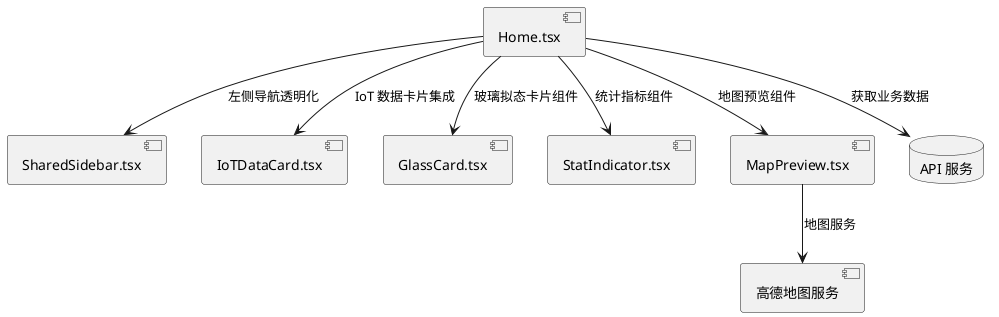

# 智行 LiveTrip UI 全级升级：沉浸式毛玻璃看板 - 设计文档

## 1. 实现模型

### 1.1 上下文视图



### 1.2 服务/组件总体架构

#### 1.2.1 整体架构设计

本次重构采用**组件化 + 玻璃拟态设计模式**，将原有 Home.tsx 页面拆分为多个可复用的玻璃拟态组件，保持原有的业务逻辑和数据流不变，仅修改 JSX 结构和 CSS 类名。

#### 1.2.2 核心组件划分

1. **GlassCard**：通用的玻璃拟态卡片组件
2. **StatIndicator**：统计指标展示组件
3. **MapPreview**：透明背景的地图预览组件
4. **GlassSidebar**：透明化的侧边栏组件（基于 SharedSidebar 修改）

#### 1.2.3 技术栈

- **前端框架**：React 18+
- **样式方案**：Tailwind CSS
- **组件库**：shadcn/ui（透明化处理）
- **地图服务**：高德地图（amapService）

### 1.3 实现设计文档

#### 1.3.1 目录结构

```
frontend/src/
├── components/
│   ├── home/
│   │   ├── GlassCard.tsx          # 玻璃拟态卡片组件
│   │   ├── StatIndicator.tsx      # 统计指标组件
│   │   ├── MapPreview.tsx         # 地图预览组件
│   │   └── GlassSidebar.tsx       # 透明侧边栏组件
│   ├── SharedSidebar.tsx          # 修改：添加透明度支持
│   └── IoTDataCard.tsx            # 修改：添加玻璃拟态样式
└── pages/
    └── Home.tsx                   # 重构：应用玻璃拟态设计
```

#### 1.3.2 实现步骤

**阶段一：基础组件开发**
1. 创建 GlassCard.tsx 通用玻璃拟态卡片组件
2. 创建 StatIndicator.tsx 统计指标组件
3. 创建 MapPreview.tsx 地图预览组件

**阶段二：侧边栏透明化**
1. 修改 SharedSidebar.tsx，添加透明度支持
2. 创建 GlassSidebar.tsx 封装透明化逻辑

**阶段三：IoT 组件玻璃化**
1. 修改 IoTDataCard.tsx，添加玻璃拟态样式

**阶段四：Home 页面重构**
1. 重构 Home.tsx 的布局结构
2. 集成新的玻璃拟态组件
3. 应用全屏背景和遮罩层
4. 实现响应式适配

## 2. 接口设计

### 2.1 总体设计

本次重构不涉及新的 API 接口设计，保持原有的 API 调用逻辑不变：
- `getUserTrips()`：获取用户行程数据
- `getFavoriteCount()`：获取收藏数量
- `getIoTData()`：获取 IoT 数据

### 2.2 组件接口设计

#### 2.2.1 GlassCard 组件接口

```typescript
interface GlassCardProps {
  children: React.ReactNode;
  className?: string;
  hover?: boolean;
  onClick?: () => void;
}
```

**设计说明**：
- `children`：卡片内容
- `className`：自定义样式类名
- `hover`：是否启用悬浮动画
- `onClick`：点击事件处理

#### 2.2.2 StatIndicator 组件接口

```typescript
interface StatIndicatorProps {
  label: string;
  value: number;
  change?: string;
  trend?: 'up' | 'down' | null;
}
```

**设计说明**：
- `label`：统计指标名称
- `value`：统计数值
- `change`：变化描述（可选）
- `trend`：趋势方向（可选）

#### 2.2.3 MapPreview 组件接口

```typescript
interface MapPreviewProps {
  tripId?: string;
  height?: string;
  className?: string;
}
```

**设计说明**：
- `tripId`：行程 ID（可选）
- `height`：地图高度
- `className`：自定义样式类名

#### 2.2.4 GlassSidebar 组件接口

```typescript
interface GlassSidebarProps extends SidebarProps {
  transparent?: boolean;
}
```

**设计说明**：
- 继承 SharedSidebar 的原有接口
- `transparent`：是否启用透明模式

### 2.3 样式系统设计

#### 2.3.1 玻璃拟态样式类

```typescript
// 基础玻璃拟态样式
const glassBase = "bg-white/10 backdrop-blur-xl border border-white/20";

// 悬浮效果
const glassHover = "hover:scale-[1.02] transition-transform duration-300";

// 阴影效果
const glassShadow = "shadow-2xl";
```

#### 2.3.2 颜色系统

```typescript
// 保留原有颜色系统
const colors = {
  primary: "#1a6b4a",           // 强调色
  primaryDark: "#0f4a32",       // 深色强调色
  accent: "#f5a623",            // 强调辅助色
  // 文字颜色适配深色背景
  text: {
    primary: "text-white",
    secondary: "text-white/80",
    muted: "text-white/60"
  }
};
```

#### 2.3.3 背景系统

```typescript
// 全屏背景
const background = {
  image: "url('https://images.unsplash.com/photo-1493976040374-85c8e12f0c0e?w=1920&q=80')",
  overlay: "bg-black/40 backdrop-blur-xl"
};
```

## 4. 数据模型

### 4.1 设计目标

保持原有的数据模型不变，不引入新的数据结构。所有数据流和状态管理逻辑保持原有实现。

### 4.2 模型实现

#### 4.2.1 现有数据模型

**行程数据模型**（保持不变）
```typescript
interface Trip {
  id: string;
  title: string;
  destination: string;
  startDate: string;
  endDate: string;
  status: 'planning' | 'completed' | 'cancelled';
  totalBudget: number;
  days?: Day[];
}
```

**统计数据模型**（保持不变）
```typescript
interface StatData {
  label: string;
  value: number;
  change?: string | null;
  trend?: 'up' | null;
}
```

**IoT 数据模型**（保持不变）
```typescript
interface IoTData {
  temperature: number;
  humidity?: number;
  crowdLevel: number;
  rainProbability: number;
  weatherDescription?: string;
  weatherIcon?: string;
  isOpen: boolean;
  waitTime?: number;
}
```

#### 4.2.2 组件状态模型

**Home 组件状态**（保持不变）
```typescript
interface HomeState {
  sidebarOpen: boolean;
  statsData: StatData[];
  recentTrips: Trip[];
  hotDestinations: Destination[];
  loading: boolean;
  isLargeScreen: boolean;
}
```

## 5. 布局架构设计

### 5.1 整体布局结构

```
┌─────────────────────────────────────────────────────────┐
│                    全屏背景图片                          │
│              + backdrop-blur-xl + bg-black/40           │
├─────────────────────────────────────────────────────────┤
│  左侧导航  │              中间核心区              │ 右侧边栏 │
│  (透明)    │                                        │         │
│            │  ┌────────────────────────────┐    │  IoT卡片 │
│  - 首页    │  │     大搜索框（居中）       │    │  天气小组件│
│  - 创建行程│  └────────────────────────────┘    │         │
│  - AI功能  │  ┌────────────────────────────┐    │         │
│  - 目的地  │  │  统计卡片（水平排列）      │    │  最近行程 │
│  - 收藏    │  └────────────────────────────┘    │  - 缩略图 │
│  - 博客    │  ┌────────────────────────────┐    │  - 垂直列表│
│  - 我的行程│  │      地图预览（透明）      │    │         │
│  - 当前行程│  └────────────────────────────┘    │         │
│            │                                        │         │
│  用户卡片  │                                        │         │
│  (透明)    │                                        │         │
└─────────────────────────────────────────────────────────┘
```

### 5.2 响应式布局策略

#### 5.2.1 断点定义

- **lg** (1024px+)：三列布局（左侧导航 + 中间核心区 + 右侧边栏）
- **md** (768px-1023px)：两列布局（左侧导航隐藏 + 中间核心区 + 右侧边栏）
- **sm** (<768px)：单列布局（左侧导航抽屉 + 中间核心区）

#### 5.2.2 组件适配策略

**主容器适配**
```typescript
// lg 及以上
className="min-h-[90vh] rounded-3xl overflow-hidden shadow-2xl border border-white/20"

// md
className="min-h-[85vh] rounded-2xl overflow-hidden shadow-xl border border-white/20"

// sm
className="min-h-screen rounded-xl overflow-hidden shadow-lg border border-white/20"
```

**侧边栏适配**
```typescript
// lg 及以上：固定显示
// md 及以下：抽屉模式
```

## 6. 性能优化设计

### 6.1 图片优化

- 使用高质量但优化过的背景图片
- 实现图片懒加载
- 提供图片加载占位符

### 6.2 毛玻璃效果优化

- 使用 CSS `backdrop-filter` 实现硬件加速
- 避免过度的模糊层数
- 在不支持的浏览器中降级为半透明背景

### 6.3 组件渲染优化

- 使用 React.memo 避免不必要的重渲染
- 使用 useMemo 缓存计算结果
- 使用 useCallback 缓存事件处理函数

## 7. 兼容性设计

### 7.1 浏览器兼容性

**backdrop-blur 兼容性**
```css
/* 现代浏览器 */
.glass-effect {
  backdrop-filter: blur(20px);
  -webkit-backdrop-filter: blur(20px);
}

/* 降级方案 */
@supports not (backdrop-filter: blur(20px)) {
  .glass-effect {
    background: rgba(255, 255, 255, 0.1);
  }
}
```

### 7.2 响应式兼容性

- 使用相对单位（rem、em、%）
- 避免固定像素值
- 使用 CSS Grid 和 Flexbox 实现弹性布局

## 8. 测试策略

### 8.1 视觉回归测试

- 对比重构前后的视觉效果
- 确保玻璃拟态效果符合设计稿
- 验证透明度和模糊效果

### 8.2 功能测试

- 验证所有导航功能正常
- 验证数据加载和显示
- 验证交互功能（点击、悬浮等）

### 8.3 性能测试

- 测量首次渲染时间
- 测量背景图片加载时间
- 测量交互响应时间

### 8.4 兼容性测试

- 在不同浏览器中测试
- 在不同分辨率下测试
- 在不同设备上测试

## 9. 部署策略

### 9.1 渐进式部署

1. 先在开发环境完成开发和测试
2. 在测试环境进行集成测试
3. 小范围灰度发布
4. 全量发布

### 9.2 回滚策略

- 保留原有代码分支
- 准备快速回滚方案
- 监控关键指标

## 10. 风险评估

### 10.1 技术风险

| 风险 | 影响 | 概率 | 缓解措施 |
|------|------|------|----------|
| 毛玻璃效果性能问题 | 高 | 中 | 优化 CSS，提供降级方案 |
| 浏览器兼容性问题 | 中 | 中 | 提供降级方案，测试多种浏览器 |
| 组件重构引入 bug | 高 | 低 | 充分测试，保留原有代码 |

### 10.2 业务风险

| 风险 | 影响 | 概率 | 缓解措施 |
|------|------|------|----------|
| 用户体验下降 | 高 | 低 | 用户调研，A/B 测试 |
| 功能回归 | 高 | 低 | 充分的功能测试 |
