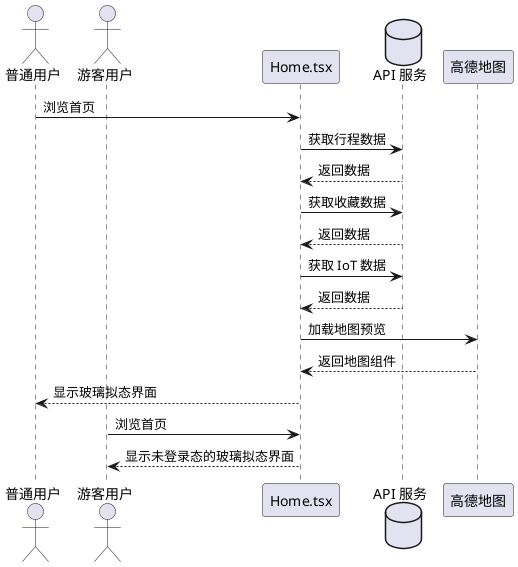
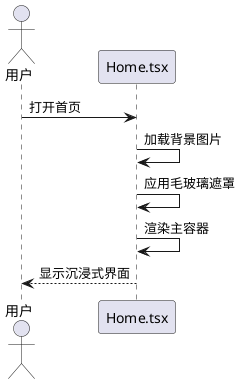
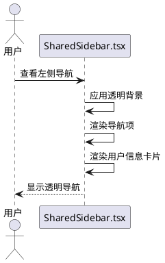
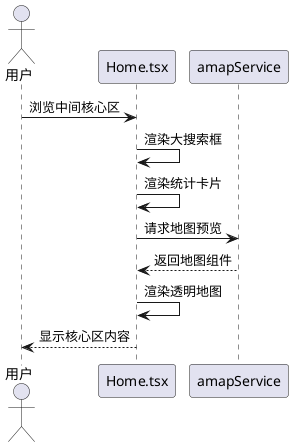
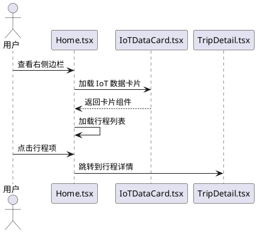
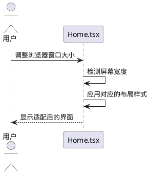

# 智行 LiveTrip UI 全级升级：沉浸式毛玻璃看板

## 1. 组件定位

### 1.1 核心职责
本组件负责重构 Home.tsx 页面，实现沉浸式玻璃拟态（Glassmorphism）视觉风格，提升用户体验和视觉吸引力。

### 1.2 核心输入
- 用户浏览首页的操作请求
- 用户的行程数据、收藏数据、IoT 数据
- 用户的导航和交互操作

### 1.3 核心输出
- 渲染后的沉浸式玻璃拟态首页界面
- 响应用户交互的状态更新
- 导航跳转操作

### 1.4 职责边界
- 不修改后端 API 接口
- 不改变现有的业务逻辑和数据流
- 不影响其他页面的功能

## 2. 领域术语

**玻璃拟态（Glassmorphism）**
: 一种视觉设计风格，通过背景模糊、半透明效果、精细边框和阴影创建类似毛玻璃的深度感。

**沉浸式设计（Immersive Design）**
: 一种设计理念，通过全屏背景、深度层次和流畅动画创造身临其境的用户体验。

**透明度处理（Opacity Handling）**
: 通过调整背景色的透明度（如 bg-white/10）实现半透明效果的技术。

## 3. 角色与边界

### 3.1 核心角色
- **普通用户**：浏览和使用 LiveTrip 首页的注册用户
- **游客用户**：未登录的访客用户

### 3.2 外部系统
- **API 服务**：提供用户行程、收藏、IoT 数据等业务数据
- **高德地图服务**：提供地图预览和位置服务

### 3.3 交互上下文

## 4. DFX 约束

### 4.1 性能
- 页面首次渲染时间应小于 2 秒
- 背景图片加载时间应小于 3 秒
- 毛玻璃效果的 backdrop-blur 不应导致明显的性能下降

### 4.2 可靠性
- 在网络不稳定时，应显示加载状态
- 在数据加载失败时，应显示友好的错误提示
- 保持原有的错误处理逻辑不变

### 4.3 安全性
- 不引入新的安全漏洞
- 保持原有的认证和授权机制

### 4.4 可维护性
- 代码结构清晰，便于后续维护
- 组件化设计，便于复用
- 保留原有的注释和文档

### 4.5 兼容性
- 支持主流现代浏览器（Chrome、Firefox、Safari、Edge）
- 在 1280px 及以上分辨率下效果最佳
- 在 1280px 以下分辨率下应适配容器布局

## 5. 核心能力

### 5.1 玻璃拟态容器设计

#### 5.1.1 业务规则

1. **主容器样式规则**
   - 验收条件：[用户浏览首页] → [系统显示 min-h-[90vh] rounded-3xl overflow-hidden shadow-2xl border border-white/20 的主容器]

2. **背景图片规则**
   - 验收条件：[用户浏览首页] → [系统显示全屏高质量旅行图片作为背景]

3. **遮罩层规则**
   - 验收条件：[用户浏览首页] → [系统在背景图片上叠加 backdrop-blur-xl 和 bg-black/40 的遮罩层]

4. **颜色系统规则**
   - 验收条件：[系统渲染界面] → [系统使用 livetrip-primary (#1a6b4a) 作为强调色]
   - 验收条件：[系统渲染界面] → [系统将主要文字颜色设置为白色或浅灰色]

#### 5.1.2 交互流程

#### 5.1.3 异常场景

1. **背景图片加载失败**
   - 触发条件：[背景图片 URL 无效或网络问题]
   - 系统行为：[使用默认背景图片或纯色背景]
   - 用户感知：[界面正常显示，但背景可能不符合预期]

2. **毛玻璃效果不支持**
   - 触发条件：[浏览器不支持 backdrop-blur]
   - 系统行为：[降级为半透明背景]
   - 用户感知：[界面仍可正常使用，视觉效果略有差异]

### 5.2 左侧导航透明化

#### 5.2.1 业务规则

1. **导航背景透明度规则**
   - 验收条件：[用户浏览首页] → [系统显示背景透明的左侧导航]

2. **导航项显示规则**
   - 验收条件：[用户浏览首页] → [系统保留导航图标和文字，移除不透明背景]

3. **用户信息卡片规则**
   - 验收条件：[用户浏览首页] → [系统在导航底部显示透明化的用户信息卡片]

#### 5.2.2 交互流程

#### 5.2.3 异常场景

1. **导航组件加载失败**
   - 触发条件：[SharedSidebar 组件加载失败]
   - 系统行为：[显示错误提示或降级显示]
   - 用户感知：[可能无法使用导航功能]

### 5.3 中间核心区重构

#### 5.3.1 业务规则

1. **搜索框位置规则**
   - 验收条件：[用户浏览首页] → [系统将搜索框移至中间核心区正上方]

2. **搜索框样式规则**
   - 验收条件：[用户浏览首页] → [系统显示大尺寸居中搜索栏，作为 AI 规划快捷入口]

3. **统计卡片布局规则**
   - 验收条件：[用户浏览首页] → [系统将"行程总数/已完成/收藏"改为水平排列的透明毛玻璃卡片]

4. **地图预览规则**
   - 验收条件：[用户浏览首页] → [系统显示大面积的足迹地图预览，背景设为透明]

#### 5.3.2 交互流程

#### 5.3.3 异常场景

1. **地图服务加载失败**
   - 触发条件：[高德地图服务不可用]
   - 系统行为：[显示地图加载失败的提示或占位符]
   - 用户感知：[无法查看地图预览，但其他功能正常]

2. **统计数据加载失败**
   - 触发条件：[API 返回错误或超时]
   - 系统行为：[显示默认数据或加载失败提示]
   - 用户感知：[统计数据可能不准确]

### 5.4 右侧边栏集成

#### 5.4.1 业务规则

1. **IoT 数据卡片规则**
   - 验收条件：[用户浏览首页] → [系统在右侧上方集成 IoTDataCard 和天气小组件]

2. **最近行程列表规则**
   - 验收条件：[用户浏览首页] → [系统在右侧下方显示带缩略图的垂直行程列表]

3. **行程跳转规则**
   - 验收条件：[用户点击行程项] → [系统跳转到 TripDetail.tsx 页面]

#### 5.4.2 交互流程

#### 5.4.3 异常场景

1. **IoT 数据加载失败**
   - 触发条件：[IoT API 返回错误]
   - 系统行为：[显示默认数据或加载失败提示]
   - 用户感知：[IoT 数据可能不准确]

2. **行程列表加载失败**
   - 触发条件：[行程 API 返回错误]
   - 系统行为：[显示加载失败提示]
   - 用户感知：[无法查看行程列表]

### 5.5 响应式适配

#### 5.5.1 业务规则

1. **全屏效果规则**
   - 验收条件：[用户在 1280px 及以上分辨率浏览] → [系统显示最佳全屏效果]

2. **容器适配规则**
   - 验收条件：[用户在 1280px 以下分辨率浏览] → [系统适配容器布局]

#### 5.5.2 交互流程

#### 5.5.3 异常场景

1. **屏幕尺寸检测失败**
   - 触发条件：[浏览器不支持屏幕尺寸检测]
   - 系统行为：[使用默认布局]
   - 用户感知：[界面可能不够适配]

## 6. 数据约束

### 6.1 行程数据对象

1. **id**：行程的唯一标识符，必须为非空字符串
2. **title**：行程标题，必须为非空字符串
3. **destination**：目的地，必须为非空字符串
4. **startDate**：开始日期，必须为有效的日期字符串
5. **endDate**：结束日期，必须为有效的日期字符串且不早于开始日期
6. **status**：行程状态，必须为 'planning'、'completed' 或 'cancelled' 之一
7. **totalBudget**：总预算，必须为非负数

### 6.2 收藏数据对象

1. **count**：收藏景点数量，必须为非负整数

### 6.3 IoT 数据对象

1. **temperature**：温度，必须为数值类型
2. **humidity**：湿度，必须为 0-100 之间的数值
3. **crowdLevel**：拥挤度，必须为 0-100 之间的数值
4. **rainProbability**：降雨概率，必须为 0-100 之间的数值
5. **weatherDescription**：天气描述，必须为非空字符串
6. **isOpen**：开放状态，必须为布尔值

## 7. 验收标准

### 7.1 视觉效果验收

1. **透明度效果**
   - 验收条件：[用户浏览首页] → [所有卡片和容器都应呈现明显的半透明效果]

2. **边框发光效果**
   - 验收条件：[用户浏览首页] → [所有容器都应有精细的 border-white/20 边框]

3. **悬浮动画效果**
   - 验收条件：[用户悬停在卡片上] → [卡片应有 hover:scale-[1.02] 的缩放动画]

### 7.2 功能验收

1. **导航功能**
   - 验收条件：[用户点击导航项] → [系统应正确跳转到对应页面]

2. **搜索功能**
   - 验收条件：[用户在搜索框输入内容] → [系统应能正常接收输入]

3. **数据加载**
   - 验收条件：[用户打开首页] → [系统应在 2 秒内加载所有数据]

4. **响应式适配**
   - 验收条件：[用户调整浏览器窗口大小] → [界面应自动适配布局]

### 7.3 性能验收

1. **首次渲染时间**
   - 验收条件：[用户打开首页] → [页面应在 2 秒内完成首次渲染]

2. **背景图片加载时间**
   - 验收条件：[用户打开首页] → [背景图片应在 3 秒内加载完成]

3. **交互响应时间**
   - 验收条件：[用户进行任何交互操作] → [系统应在 100ms 内响应]

## 8. 非功能性需求

### 8.1 可访问性
- 所有文本内容应具有足够的对比度
- 所有交互元素应可通过键盘访问
- 所有图片应提供 alt 文本

### 8.2 浏览器兼容性
- 支持 Chrome 90+
- 支持 Firefox 88+
- 支持 Safari 14+
- 支持 Edge 90+

### 8.3 代码质量
- 遵循项目现有的代码规范
- 保持代码的可读性和可维护性
- 添加必要的注释和文档
