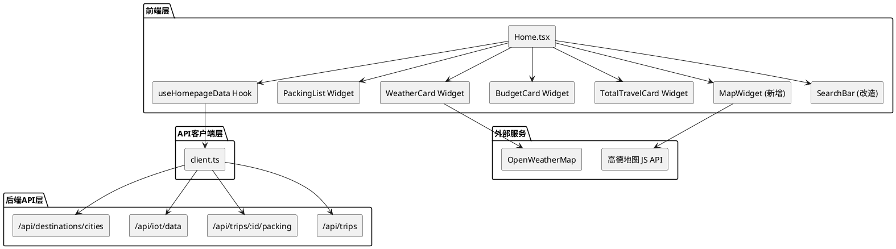

# 首页控件数据连接技术设计文档

## 1. 实现模型

### 1.1 上下文视图



### 1.2 服务/组件总体架构

#### 前端组件架构
```
Home.tsx (首页容器)
├── useHomepageData Hook (数据管理)
│   ├── fetchUserTrips() - 获取用户行程
│   ├── fetchPackingList() - 获取行李清单
│   ├── fetchWeatherData() - 获取天气数据
│   ├── fetchBudgetData() - 获取预算数据
│   └── calculateStats() - 计算统计数据
├── PackingList Widget (行李清单控件)
├── WeatherCard Widget (天气控件)
├── BudgetCard Widget (预算控件)
├── TotalTravelCard Widget (统计控件)
├── MapWidget (地图控件 - 新增)
└── SearchBar (搜索栏 - 改造)
```

#### 数据流向
```
用户打开首页
  ↓
useHomepageData Hook 初始化
  ↓
并行请求:
  - GET /api/trips (获取行程列表)
  - GET /api/iot/data (获取IoT数据)
  - GET /api/destinations/cities (获取热门城市)
  ↓
确定当前行程
  ↓
并行请求:
  - GET /api/trips/:tripId/packing (获取行李清单)
  - GET /api/trips/:tripId (获取行程详情含预算)
  ↓
数据处理:
  - 计算打包进度
  - 提取天气信息
  - 计算预算分配
  - 统计旅行数据
  - 提取足迹城市
  ↓
渲染各控件
```

### 1.3 实现设计文档

#### 1.3.1 useHomepageData Hook 改造

**当前实现问题**：
- 天气数据从IoT数据中提取，但IoT数据是景点级别的，不是城市级别
- 缺少地图控件的数据支持（足迹城市列表）
- 搜索功能未实现

**改造方案**：

```typescript
// useHomepageData.ts 改造点

interface UseHomepageDataReturn {
  // 现有数据
  loading: boolean;
  error: string | null;
  packingItems: PackingItem[];
  packingProgress: number;
  weatherData: WeatherData | null;
  budgetData: BudgetData | null;
  tripStats: TripStats;
  upcomingTrips: UpcomingTrip[];
  tripDates: TripDate[];
  currentTripId: string | null;

  // 新增数据
  footprintCities: FootprintCity[];  // 足迹城市列表
  hotDestinations: HotDestination[]; // 热门目的地列表
  searchResults: SearchResult[];     // 搜索结果

  // 新增方法
  search: (keyword: string) => Promise<void>;  // 搜索方法
  togglePacked: (itemId: string) => Promise<void>;  // 切换打包状态
}

interface FootprintCity {
  name: string;
  location: string;  // "lng,lat"
  tripCount: number; // 去过几次
  tripIds: string[]; // 相关行程ID
}

interface HotDestination {
  city: string;
  spotCount: number;
  image?: string;
}

interface SearchResult {
  type: 'destination' | 'trip';
  id: string;
  title: string;
  subtitle: string;
  image?: string;
}
```

**数据获取逻辑改造**：

```typescript
// 1. 获取天气数据 - 改造
const fetchWeatherData = async (city: string) => {
  try {
    // 方案1: 使用OpenWeatherMap API直接查询城市天气
    const response = await axios.get(
      `https://api.openweathermap.org/data/2.5/weather?q=${city}&appid=${API_KEY}&units=metric&lang=zh_cn`
    );

    setWeatherData({
      city: response.data.name,
      temperature: response.data.main.temp,
      condition: response.data.weather[0].description,
      humidity: response.data.main.humidity,
      windSpeed: response.data.wind.speed,
      pressure: response.data.main.pressure,
    });
  } catch (err) {
    // 降级方案: 使用北京天气
    fetchWeatherData('北京');
  }
};

// 2. 计算足迹城市 - 新增
const calculateFootprintCities = (trips: Trip[]): FootprintCity[] => {
  const cityMap = new Map<string, FootprintCity>();

  trips.forEach(trip => {
    if (!trip.destination) return;

    const city = cityMap.get(trip.destination);
    if (city) {
      city.tripCount++;
      city.tripIds.push(trip.id);
    } else {
      cityMap.set(trip.destination, {
        name: trip.destination,
        location: '', // 需要从景点数据中获取城市坐标
        tripCount: 1,
        tripIds: [trip.id],
      });
    }
  });

  return Array.from(cityMap.values());
};

// 3. 搜索功能 - 新增
const search = async (keyword: string) => {
  if (!keyword.trim()) {
    // 显示热门推荐
    setSearchResults(
      hotDestinations.map(dest => ({
        type: 'destination',
        id: dest.city,
        title: dest.city,
        subtitle: `${dest.spotCount}个热门景点`,
        image: dest.image,
      }))
    );
    return;
  }

  const results: SearchResult[] = [];

  // 搜索热门目的地
  const matchedDests = hotDestinations.filter(dest =>
    dest.city.includes(keyword)
  );
  results.push(...matchedDests.map(dest => ({
    type: 'destination' as const,
    id: dest.city,
    title: dest.city,
    subtitle: `${dest.spotCount}个热门景点`,
    image: dest.image,
  })));

  // 搜索用户行程
  const response = await getUserTrips();
  if (response.data.success) {
    const matchedTrips = response.data.trips.filter((trip: Trip) =>
      trip.title.includes(keyword) || trip.destination.includes(keyword)
    );
    results.push(...matchedTrips.map((trip: Trip) => ({
      type: 'trip' as const,
      id: trip.id,
      title: trip.title,
      subtitle: trip.destination,
      image: trip.coverImage,
    })));
  }

  setSearchResults(results);
};
```

#### 1.3.2 地图控件实现

**组件结构**：

```typescript
// MapWidget.tsx

interface MapWidgetProps {
  cities: FootprintCity[];
  onCityClick?: (city: FootprintCity) => void;
}

const MapWidget: React.FC<MapWidgetProps> = ({ cities, onCityClick }) => {
  const mapRef = useRef<any>(null);
  const [mapLoaded, setMapLoaded] = useState(false);

  useEffect(() => {
    // 初始化高德地图
    AMapLoader.load({
      key: VITE_AMAP_JS_KEY,
      version: '2.0',
      plugins: ['AMap.Scale', 'AMap.Marker'],
    }).then((AMap) => {
      const map = new AMap.Map(mapRef.current, {
        zoom: 5,
        center: [104.195397, 35.86169], // 中国中心
        mapStyle: 'amap://styles/whitesmoke',
      });

      // 添加城市标记
      cities.forEach(city => {
        if (!city.location) return;

        const [lng, lat] = city.location.split(',').map(Number);
        const marker = new AMap.Marker({
          position: [lng, lat],
          title: city.name,
          content: `<div class="custom-marker">${city.name}</div>`,
        });

        marker.on('click', () => onCityClick?.(city));
        map.add(marker);
      });

      setMapLoaded(true);
    }).catch((err) => {
      console.error('地图加载失败:', err);
    });
  }, [cities]);

  if (!mapLoaded) {
    return <div>地图加载中...</div>;
  }

  return <div ref={mapRef} style={{ width: '100%', height: '400px' }} />;
};
```

**样式设计**：

```css
/* 自定义地图标记样式 */
.custom-marker {
  background: linear-gradient(135deg, #f59e0b, #d97706);
  color: white;
  padding: 4px 8px;
  border-radius: 12px;
  font-size: 12px;
  font-weight: 600;
  box-shadow: 0 2px 8px rgba(245, 158, 11, 0.3);
  white-space: nowrap;
}
```

#### 1.3.3 搜索栏改造

**组件结构**：

```typescript
// SearchBar.tsx

interface SearchBarProps {
  onSearch: (keyword: string) => void;
  hotDestinations: HotDestination[];
}

const SearchBar: React.FC<SearchBarProps> = ({ onSearch, hotDestinations }) => {
  const [keyword, setKeyword] = useState('');
  const [showDropdown, setShowDropdown] = useState(false);

  const handleSearch = () => {
    onSearch(keyword);
    setShowDropdown(true);
  };

  return (
    <div className="relative">
      <input
        type="text"
        value={keyword}
        onChange={(e) => setKeyword(e.target.value)}
        placeholder="搜索热门目的地或我的行程"
        className="w-full px-6 py-4 rounded-xl bg-white/10 backdrop-blur-md border border-white/20 text-white placeholder-white/40"
        onKeyPress={(e) => e.key === 'Enter' && handleSearch()}
      />

      {showDropdown && (
        <SearchDropdown
          keyword={keyword}
          hotDestinations={hotDestinations}
          onSelect={(result) => {
            // 跳转到对应页面
            if (result.type === 'destination') {
              navigate(`/destinations/${result.id}`);
            } else {
              navigate(`/trips/${result.id}`);
            }
            setShowDropdown(false);
          }}
        />
      )}
    </div>
  );
};
```

## 2. 接口设计

### 2.1 总体设计

**现有接口复用**：
- `GET /api/trips` - 获取用户行程列表
- `GET /api/trips/:tripId/packing` - 获取行李清单
- `GET /api/trips/:tripId` - 获取行程详情（含预算）
- `GET /api/iot/data` - 获取IoT数据
- `GET /api/destinations/cities` - 获取热门城市

**新增接口需求**：
- 无需新增后端接口，前端通过组合现有接口实现功能

### 2.2 接口清单

#### 2.2.1 获取用户行程列表
```
GET /api/trips
Headers: Authorization: Bearer {token}

Response:
{
  "success": true,
  "data": [
    {
      "id": "trip_001",
      "title": "北京三日游",
      "destination": "北京",
      "startDate": "2024-05-01",
      "endDate": "2024-05-03",
      "status": "planning",
      "totalBudget": 5000,
      "budget": {
        "transportation": 1000,
        "accommodation": 1500,
        "food": 800,
        "tickets": 500,
        "shopping": 700,
        "other": 500
      },
      "days": [...]
    }
  ]
}
```

#### 2.2.2 获取行李清单
```
GET /api/trips/:tripId/packing
Headers: Authorization: Bearer {token}

Response:
{
  "success": true,
  "packingItems": [
    {
      "id": "item_001",
      "itemName": "护照",
      "category": "证件",
      "isPacked": true,
      "isSuggested": true
    }
  ]
}
```

#### 2.2.3 获取IoT数据
```
GET /api/iot/data

Response:
{
  "success": true,
  "data": {
    "timestamp": 1714521600000,
    "spots": [
      {
        "id": "spot_001",
        "name": "故宫",
        "temperature": 22,
        "humidity": 45,
        "weatherDescription": "晴",
        "weatherIcon": "01d",
        "crowdLevel": 75,
        "rainProbability": 0,
        "isOpen": true
      }
    ]
  }
}
```

#### 2.2.4 获取热门城市
```
GET /api/destinations/cities

Response:
{
  "success": true,
  "data": [
    {
      "city": "北京",
      "spotCount": 65,
      "image": "https://example.com/beijing.jpg"
    },
    {
      "city": "上海",
      "spotCount": 58,
      "image": "https://example.com/shanghai.jpg"
    }
  ]
}
```

## 3. 数据模型

### 3.1 设计目标

**数据一致性**：
- 确保前端展示数据与后端API返回数据结构一致
- 使用TypeScript接口定义严格类型约束

**数据完整性**：
- 提供默认值和降级方案，避免空值错误
- 数据缺失时显示友好提示

**数据实时性**：
- 使用React Query或SWR实现数据缓存和自动刷新
- 天气数据每小时更新一次

### 3.2 模型实现

#### 3.2.1 行李清单模型

```typescript
// types/packing.ts

export interface PackingItem {
  id: string;
  name: string;        // 物品名称
  packed: boolean;     // 打包状态
  category: PackingCategory;  // 分类
  isSuggested?: boolean;  // 是否为系统建议
}

export type PackingCategory =
  | '衣物'
  | '洗漱'
  | '电子'
  | '证件'
  | '药品'
  | '其他';

export interface PackingProgress {
  total: number;       // 总物品数
  packed: number;      // 已打包数
  percentage: number;  // 打包百分比
}
```

#### 3.2.2 天气数据模型

```typescript
// types/weather.ts

export interface WeatherData {
  city: string;           // 城市名称
  temperature: number;    // 温度（摄氏度）
  condition: string;      // 天气状况描述
  humidity: number;       // 湿度（百分比）
  windSpeed: number;      // 风速（m/s）
  pressure: number;       // 气压（hPa）
  icon?: string;          // 天气图标代码
  updatedAt?: Date;       // 更新时间
}

export interface WeatherAPIResponse {
  name: string;
  main: {
    temp: number;
    humidity: number;
    pressure: number;
  };
  weather: Array<{
    description: string;
    icon: string;
  }>;
  wind: {
    speed: number;
  };
}
```

#### 3.2.3 预算数据模型

```typescript
// types/budget.ts

export interface BudgetData {
  transportation: number;  // 交通费用
  accommodation: number;   // 住宿费用
  food: number;            // 餐饮费用
  tickets: number;         // 门票费用
  shopping: number;        // 购物费用
  other: number;           // 其他费用
  total: number;           // 总预算
}

export interface BudgetAllocation {
  category: string;
  amount: number;
  percentage: number;
  color: string;
}

// 预算分类颜色映射
export const BUDGET_COLORS: Record<keyof Omit<BudgetData, 'total'>, string> = {
  transportation: '#3b82f6',  // 蓝色
  accommodation: '#8b5cf6',   // 紫色
  food: '#f59e0b',            // 琥珀色
  tickets: '#10b981',         // 绿色
  shopping: '#ec4899',        // 粉色
  other: '#6b7280',           // 灰色
};
```

#### 3.2.4 旅行统计模型

```typescript
// types/trip.ts

export interface TripStats {
  totalTrips: number;      // 总行程数
  totalCities: number;     // 去过的城市数
  completedTrips: number;  // 已完成行程数
  upcomingTrips: number;   // 即将出行数
}

export interface FootprintCity {
  name: string;            // 城市名称
  location: string;        // 经纬度 "lng,lat"
  tripCount: number;       // 去过几次
  tripIds: string[];       // 相关行程ID列表
}

export interface UpcomingTrip {
  id: string;
  title: string;
  destination: string;
  startDate: string;
  endDate: string;
  days: number;
}
```

#### 3.2.5 搜索结果模型

```typescript
// types/search.ts

export interface SearchResult {
  type: 'destination' | 'trip';  // 结果类型
  id: string;                     // 唯一标识
  title: string;                  // 标题
  subtitle: string;               // 副标题
  image?: string;                 // 图片URL
}

export interface HotDestination {
  city: string;        // 城市名称
  spotCount: number;   // 热门景点数量
  image?: string;      // 城市图片
}
```

#### 3.2.6 API响应模型

```typescript
// types/api.ts

export interface ApiResponse<T> {
  success: boolean;
  data?: T;
  error?: string;
  message?: string;
}

export interface TripListResponse {
  trips: Trip[];
}

export interface PackingListResponse {
  packingItems: PackingItem[];
}

export interface IoTDataResponse {
  timestamp: number;
  spots: SpotIoTData[];
}

export interface DestinationListResponse {
  cities: HotDestination[];
}
```

## 4. 性能优化设计

### 4.1 数据加载策略

**并行加载**：
```typescript
// 使用Promise.all并行请求
const [tripsRes, iotRes, destRes] = await Promise.all([
  getUserTrips(),
  getIoTData(),
  getHotDestinations(),
]);
```

**懒加载**：
- 地图控件使用React.lazy懒加载，不阻塞首屏渲染
- 搜索下拉框在用户输入时才加载

**缓存策略**：
- 使用React Query缓存API响应
- 天气数据缓存1小时
- 行程列表缓存5分钟

### 4.2 渲染优化

**虚拟列表**：
- 行李清单超过20项时使用虚拟列表

**防抖节流**：
- 搜索输入使用防抖（300ms）
- 地图缩放使用节流（100ms）

**骨架屏**：
- 数据加载时显示骨架屏，避免布局抖动

## 5. 错误处理设计

### 5.1 错误分类

**网络错误**：
- API请求失败
- 超时错误

**数据错误**：
- 数据格式不匹配
- 必填字段缺失

**业务错误**：
- 用户无权限
- 资源不存在

### 5.2 错误处理策略

```typescript
// 统一错误处理
const handleApiError = (error: any, fallbackData: any) => {
  console.error('API Error:', error);

  if (error.response?.status === 401) {
    // 未授权，跳转登录
    navigate('/auth');
  } else if (error.response?.status === 404) {
    // 资源不存在，使用默认数据
    return fallbackData;
  } else {
    // 其他错误，显示提示
    message.error('加载失败，请稍后重试');
    return fallbackData;
  }
};
```

### 5.3 降级方案

**天气数据降级**：
- 定位失败 → 使用北京天气
- API失败 → 使用默认数据（20℃，晴）

**地图降级**：
- 高德地图加载失败 → 显示静态地图图片
- WebGL不支持 → 显示城市列表

**搜索降级**：
- API失败 → 显示热门推荐
- 无结果 → 显示空状态提示

## 6. 安全设计

### 6.1 数据安全

**认证鉴权**：
- 所有API请求携带token
- token过期自动跳转登录

**数据隔离**：
- 只能访问自己的行程数据
- 后端验证userId

### 6.2 XSS防护

**输入过滤**：
- 搜索关键词过滤特殊字符
- 使用DOMPurify清理HTML

**输出转义**：
- React自动转义，无需额外处理

### 6.3 CSRF防护

**Token验证**：
- 使用JWT token，无需CSRF token
- 每次请求携带Authorization header
