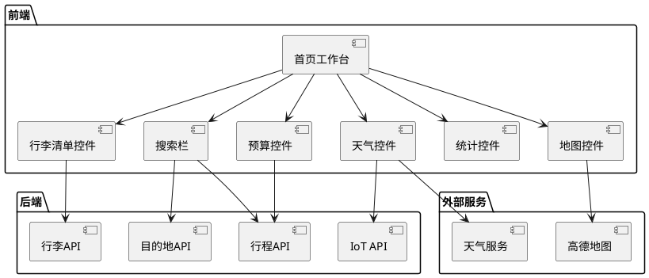
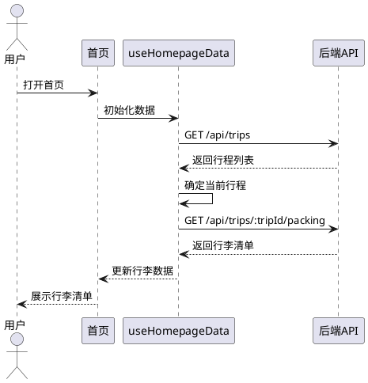
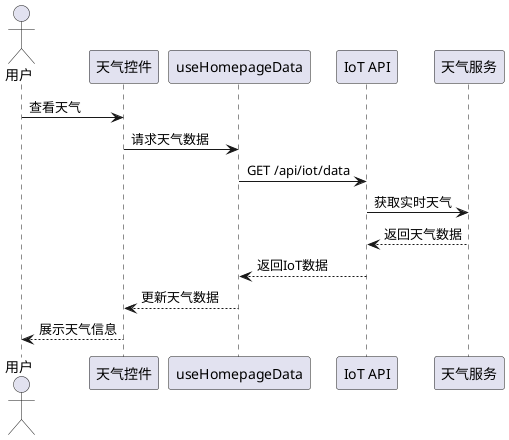
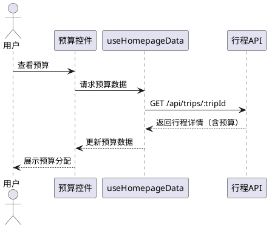
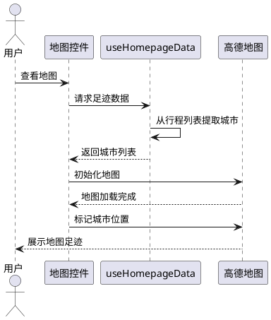
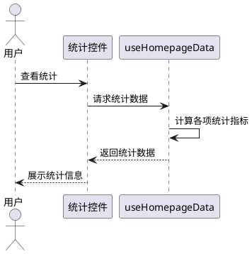
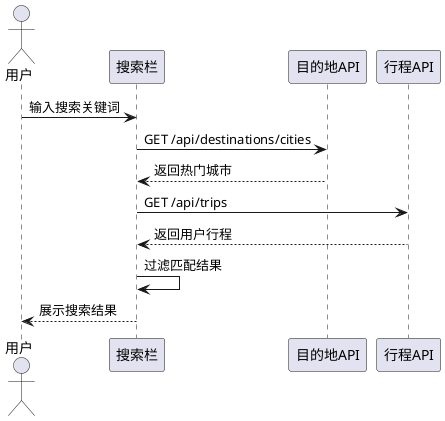

# 首页控件数据连接需求规格文档

## 1. 组件定位

### 1.1 核心职责
本组件负责连接首页的6个核心控件与后端API，实现数据的实时展示和交互，为用户提供个性化的旅行工作台视图。

### 1.2 核心输入
1. 用户认证信息（token）- 用于获取用户相关数据
2. 用户行程列表 - 从 `/api/trips` 获取
3. 行李清单数据 - 从 `/api/trips/:tripId/packing` 获取
4. IoT实时数据 - 从 `/api/iot/data` 获取
5. 热门目的地数据 - 从 `/api/destinations/cities` 获取
6. 用户搜索输入 - 搜索热门目的地和行程

### 1.3 核心输出
1. 行李清单展示 - 显示当前行程的打包物品和进度
2. 天气信息展示 - 显示当前位置或默认城市的天气
3. 预算信息展示 - 显示当前行程的预算分配
4. 地图足迹展示 - 在中国地图上标记用户去过的城市
5. 旅行统计展示 - 显示总行程数、城市数等统计数据
6. 搜索结果展示 - 返回匹配的热门目的地和行程

### 1.4 职责边界
本组件不负责：
- 行程的创建和编辑（由 PlanGlass 页面负责）
- 行程详情查看（由 TripDetail 页面负责）
- 用户认证和登录（由 Auth 页面负责）
- 景点详情查看（由 DestinationDetail 页面负责）

## 2. 领域术语

**当前行程**
: 用户最近创建或即将出行的行程，用于展示行李清单和预算信息。
: 备注：优先选择开始日期 >= 当前日期的行程，如果没有则选择最近创建的行程。

**行李清单**
: 行程相关的打包物品列表，包含物品名称、分类、打包状态等信息。

**IoT实时数据**
: 景点的实时信息，包括拥挤度、温度、湿度、降雨概率、天气描述等。

**旅行足迹**
: 用户去过的所有城市的集合，用于在地图上标记展示。

**热门目的地**
: 系统推荐的旅游城市列表，包含城市名称和精选景点数量。

## 3. 角色与边界

### 3.1 核心角色
- 已登录用户：查看个人工作台，管理行程和行李清单
- 未登录访客：查看落地页，引导注册登录

### 3.2 外部系统
- 后端API服务：提供行程、行李、IoT、目的地等数据接口
- 高德地图API：提供地图展示和地理编码服务
- OpenWeatherMap API：提供实时天气数据

### 3.3 交互上下文

## 4. DFX约束

### 4.1 性能
- 首页加载时间不超过3秒
- 各控件数据并行加载，避免串行等待
- 地图控件懒加载，不阻塞首屏渲染
- 搜索响应时间不超过500ms

### 4.2 可靠性
- 单个控件数据加载失败不影响其他控件展示
- 提供默认数据和降级展示方案
- 网络错误时显示友好的错误提示

### 4.3 安全性
- 所有API请求必须携带认证token
- 用户数据隔离，只能访问自己的行程
- 搜索结果过滤敏感信息

### 4.4 可维护性
- 使用统一的Hook管理数据获取逻辑
- 各控件独立封装，便于单独测试和维护
- 错误日志记录，便于问题排查

### 4.5 兼容性
- 支持主流浏览器（Chrome、Firefox、Safari、Edge）
- 响应式设计，适配桌面和移动设备
- 地图控件支持降级展示（不支持WebGL时显示静态图）

## 5. 核心能力

### 5.1 行李清单展示

#### 5.1.1 业务规则
1. **数据来源规则**：必须使用当前行程的行李清单数据
   - 验收条件：[用户登录且有当前行程] → [显示该行程的行李清单]

2. **空状态处理**：当行李清单为空时，显示引导提示
   - 验收条件：[当前行程无行李清单] → [显示"暂无行李清单，开始规划您的行程吧"]

3. **打包进度计算**：实时计算已打包物品占比
   - 验收条件：[行李清单有10个物品，已打包5个] → [显示进度50%]

4. **禁止项**：禁止显示其他用户的行李清单
   - 验收条件：[用户A登录] → [不显示用户B的行李清单]

#### 5.1.2 交互流程

#### 5.1.3 异常场景
1. **获取行李清单失败**
   - 触发条件：网络错误或API返回错误
   - 系统行为：记录错误日志，使用空数组作为默认值
   - 用户感知：显示"暂无行李清单"

2. **当前行程不存在**
   - 触发条件：用户无任何行程
   - 系统行为：跳过行李清单加载
   - 用户感知：显示引导创建行程提示

### 5.2 天气信息展示

#### 5.2.1 业务规则
1. **位置获取规则**：优先显示用户当前位置天气，失败则显示北京天气
   - 验收条件：[定位成功] → [显示当前位置天气]
   - 验收条件：[定位失败] → [显示北京天气]

2. **数据来源规则**：从IoT数据中提取天气信息
   - 验收条件：[调用IoT API] → [返回温度、湿度、天气描述等]

3. **数据更新规则**：天气数据每小时自动刷新一次
   - 验收条件：[距离上次更新超过1小时] → [重新获取天气数据]

4. **禁止项**：禁止显示已关闭景点的天气信息
   - 验收条件：[景点isOpen=false] → [不展示该景点天气]

#### 5.2.2 交互流程

#### 5.2.3 异常场景
1. **定位权限被拒绝**
   - 触发条件：用户拒绝浏览器定位权限
   - 系统行为：使用北京作为默认城市
   - 用户感知：显示北京天气，无错误提示

2. **IoT数据获取失败**
   - 触发条件：网络错误或API返回错误
   - 系统行为：使用默认天气数据（温度20℃，晴）
   - 用户感知：显示默认天气信息

### 5.3 预算信息展示

#### 5.3.1 业务规则
1. **数据来源规则**：使用当前行程的预算数据
   - 验收条件：[当前行程有预算] → [显示预算分配]

2. **预算组成规则**：预算包含交通、住宿、餐饮、门票、购物、其他六类
   - 验收条件：[预算数据完整] → [显示各类预算占比]

3. **空状态处理**：当预算为0时，显示提示信息
   - 验收条件：[总预算为0] → [显示"暂无预算信息"]

4. **禁止项**：禁止显示其他用户的预算信息
   - 验收条件：[用户A登录] → [不显示用户B的预算]

#### 5.3.2 交互流程

#### 5.3.3 异常场景
1. **预算数据缺失**
   - 触发条件：行程无预算信息
   - 系统行为：显示默认值0
   - 用户感知：显示"暂无预算信息"

### 5.4 地图足迹展示

#### 5.4.1 业务规则
1. **足迹数据规则**：统计用户所有行程去过的城市
   - 验收条件：[用户有3个行程，分别去北京、上海、杭州] → [地图标记3个城市]

2. **地图展示规则**：使用高德地图展示中国地图
   - 验收条件：[地图加载成功] → [显示中国地图，标记足迹城市]

3. **交互规则**：点击城市标记可查看相关行程
   - 验收条件：[点击北京标记] → [显示去北京的行程列表]

4. **禁止项**：禁止标记未去过的城市
   - 验收条件：[用户未去过成都] → [地图不标记成都]

#### 5.4.2 交互流程

#### 5.4.3 异常场景
1. **地图加载失败**
   - 触发条件：高德地图API加载失败
   - 系统行为：显示静态地图图片
   - 用户感知：显示简化版地图

2. **无足迹数据**
   - 触发条件：用户无任何行程
   - 系统行为：显示空白地图
   - 用户感知：显示"开始您的第一次旅行吧"

### 5.5 旅行统计展示

#### 5.5.1 业务规则
1. **统计维度规则**：统计总行程数、去过的城市数、已完成行程数、即将出行数
   - 验收条件：[用户有5个行程，去过3个城市，完成2个，即将出行1个] → [显示对应数字]

2. **城市统计规则**：去重统计行程目的地城市
   - 验收条件：[2个行程都去北京] → [城市数显示1]

3. **时间判断规则**：即将出行指开始日期 >= 当前日期的行程
   - 验收条件：[行程开始日期为明天] → [计入即将出行]

4. **禁止项**：禁止统计其他用户的数据
   - 验收条件：[用户A登录] → [不统计用户B的行程]

#### 5.5.2 交互流程

#### 5.5.3 异常场景
1. **无行程数据**
   - 触发条件：用户无任何行程
   - 系统行为：所有统计显示0
   - 用户感知：显示"0次旅行，0个城市"

### 5.6 搜索功能

#### 5.6.1 业务规则
1. **搜索范围规则**：仅搜索热门目的地和用户创建的行程
   - 验收条件：[输入"北京"] → [返回北京热门目的地和去北京的行程]

2. **搜索排序规则**：热门目的地优先，行程按相关性排序
   - 验收条件：[搜索结果包含目的地和行程] → [目的地在前，行程在后]

3. **空搜索处理**：输入为空时显示热门推荐
   - 验收条件：[搜索框为空] → [显示热门目的地]

4. **禁止项**：禁止搜索攻略内容
   - 验收条件：[输入任何关键词] → [不返回攻略结果]

#### 5.6.2 交互流程

#### 5.6.3 异常场景
1. **搜索无结果**
   - 触发条件：关键词不匹配任何目的地或行程
   - 系统行为：显示"未找到相关结果"
   - 用户感知：显示空状态提示

2. **搜索API失败**
   - 触发条件：网络错误或API返回错误
   - 系统行为：显示错误提示
   - 用户感知：显示"搜索失败，请重试"

## 6. 数据约束

### 6.1 行李清单项（PackingItem）
- **id**：唯一标识符，必填
- **name**：物品名称，必填，最大长度50字符
- **packed**：打包状态，布尔值，默认false
- **category**：物品分类，必填，枚举值（衣物、洗漱、电子、证件、其他）

### 6.2 天气数据（WeatherData）
- **city**：城市名称，必填，最大长度20字符
- **temperature**：温度，必填，数值范围-50到50
- **condition**：天气状况，必填，最大长度20字符
- **humidity**：湿度，必填，数值范围0到100
- **windSpeed**：风速，必填，数值范围0到100
- **pressure**：气压，必填，数值范围900到1100

### 6.3 预算数据（BudgetData）
- **transportation**：交通费用，必填，数值 >= 0
- **accommodation**：住宿费用，必填，数值 >= 0
- **food**：餐饮费用，必填，数值 >= 0
- **tickets**：门票费用，必填，数值 >= 0
- **shopping**：购物费用，必填，数值 >= 0
- **other**：其他费用，必填，数值 >= 0
- **total**：总预算，必填，数值 >= 0

### 6.4 旅行统计（TripStats）
- **totalTrips**：总行程数，必填，整数 >= 0
- **totalCities**：去过的城市数，必填，整数 >= 0
- **completedTrips**：已完成行程数，必填，整数 >= 0
- **upcomingTrips**：即将出行数，必填，整数 >= 0

### 6.5 搜索结果（SearchResult）
- **type**：结果类型，必填，枚举值（destination、trip）
- **id**：唯一标识符，必填
- **title**：标题，必填，最大长度100字符
- **subtitle**：副标题，可选，最大长度200字符
- **image**：图片URL，可选
