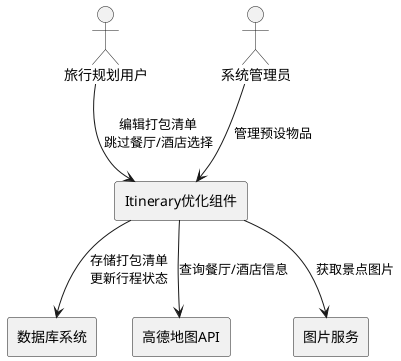
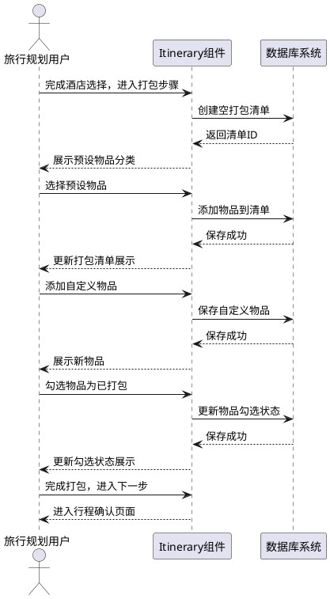
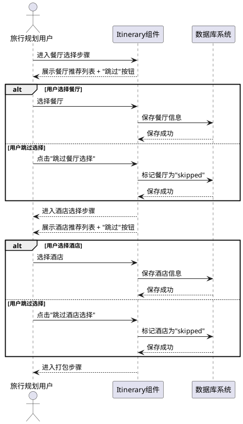
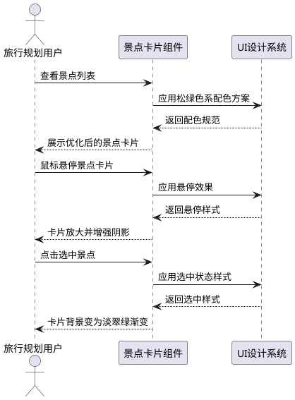

# LiveTrip Itinerary 界面升级需求规格文档

## 1. 组件定位

### 1.1 核心职责

本组件负责行程规划流程的优化与扩展，实现行李打包管理、餐厅酒店选择灵活性提升、以及景点卡片视觉优化三大核心能力。

### 1.2 核心输入

1. **用户行程规划数据**：来自PlanGlass页面的行程基础信息（目的地、日期、预算等）
2. **用户打包操作指令**：添加/删除/勾选打包物品的操作请求
3. **用户跳过操作指令**：在餐厅/酒店选择步骤的跳过操作
4. **预设物品清单数据**：系统提供的默认旅行物品清单
5. **用户自定义物品数据**：用户添加的自定义打包物品

### 1.3 核心输出

1. **打包清单数据**：存储到数据库的打包物品列表及勾选状态
2. **行程完整数据**：包含打包清单的完整行程信息
3. **跳过状态记录**：餐厅/酒店选择的跳过状态标记
4. **优化后的景点卡片**：应用新配色方案的景点展示组件

### 1.4 职责边界

本组件**不负责**：
- 地图组件的视觉优化（地图相关组件保持不变）
- 行程AI生成逻辑的修改
- 用户认证与权限管理
- 支付与订单处理
- 其他页面（如首页、收藏页）的视觉优化

---

## 2. 领域术语

**打包清单（Packing List）**
: 与特定行程关联的物品准备清单，包含物品名称、分类、勾选状态等信息。

**预设物品（Preset Items）**
: 系统预定义的常用旅行物品，按分类组织，用户可快速添加到打包清单。

**自定义物品（Custom Items）**
: 用户根据个人需求添加的非预设物品，存储在打包清单中。

**跳过功能（Skip Function）**
: 允许用户在餐厅或酒店选择步骤中选择不进行选择，直接进入下一步的功能。

**景点卡片（Attraction Card）**
: 展示景点信息的UI组件，包含景点名称、图片、评分、地址等信息。

**松绿色（Pine Green）**
: LiveTrip品牌主色调，色值#145F39，用于步骤指示器、重要元素等。

**淡翠绿（Pale Emerald）**
: 清新明亮的绿色，色值#CDEDDE，用于主按钮、群体类型选中状态等。

**墨绿色（Ink Green）**
: 深沉稳重的绿色，色值#005746，用于按钮文字、定位功能等。

---

## 3. 角色与边界

### 3.1 核心角色

- **旅行规划用户**：创建和管理行程、编辑打包清单、选择或跳过餐厅酒店
- **系统管理员**：管理预设物品清单、维护系统配置

### 3.2 外部系统

- **数据库系统**：存储打包清单、行程数据、餐厅酒店选择状态
- **高德地图API**：提供景点、餐厅、酒店的地理位置和详细信息
- **图片服务**：提供景点封面图片

### 3.3 交互上下文

---

## 4. DFX约束

### 4.1 性能

- 打包清单加载时间不超过1秒
- 物品勾选状态更新响应时间不超过200毫秒
- 预设物品清单展示时间不超过500毫秒
- 景点卡片渲染时间不超过300毫秒

### 4.2 可靠性

- 打包清单数据必须持久化存储，刷新页面不丢失
- 跳过状态必须正确保存，不影响后续流程
- 系统异常时，用户编辑的打包清单应自动保存到本地存储

### 4.3 安全性

- 打包清单数据仅对行程创建者可见
- 用户自定义物品需进行XSS过滤
- 敏感操作（删除物品）需二次确认

### 4.4 可维护性

- 打包清单操作需记录操作日志
- 跳过功能使用情况需统计上报
- 景点卡片配色需遵循UI设计指导文档规范

### 4.5 兼容性

- 新增打包清单功能不影响现有行程数据
- 跳过功能向后兼容，旧行程数据默认为未跳过状态
- 配色优化不影响现有地图组件

---

## 5. 核心能力

## 5.1 行李打包管理

### 5.1.1 业务规则

1. **打包清单创建规则**：当用户完成酒店选择步骤后，系统必须自动创建空的打包清单并展示打包步骤
   - 验收条件：[用户选择完酒店并点击下一步] → [系统创建打包清单并进入打包步骤]

2. **预设物品展示规则**：系统必须按分类展示预设物品清单，分类包括证件类、电子设备、衣物类、洗漱用品、药品类、其他
   - 验收条件：[用户进入打包步骤] → [系统展示6个分类的预设物品]

3. **物品添加规则**：用户可以从预设清单中选择物品添加到打包清单，也可以自定义添加新物品
   - 验收条件：[用户点击预设物品] → [物品添加到打包清单]
   - 验收条件：[用户输入自定义物品名称并确认] → [自定义物品添加到打包清单]

4. **物品勾选规则**：用户可以勾选已打包的物品，勾选状态必须持久化存储
   - 验收条件：[用户勾选物品] → [物品状态更新为已打包并保存到数据库]
   - 验收条件：[用户刷新页面] → [已勾选物品保持勾选状态]

5. **物品删除规则**：用户可以删除打包清单中的物品，删除操作需二次确认
   - 验收条件：[用户点击删除并确认] → [物品从打包清单中移除]

6. **物品编辑规则**：用户可以编辑自定义物品的名称和分类
   - 验收条件：[用户点击编辑并修改物品信息] → [物品信息更新并保存]

7. **禁止项**：预设物品不可编辑名称，仅可添加或移除
   - 验收条件：[用户尝试编辑预设物品名称] → [系统提示预设物品不可编辑]

### 5.1.2 交互流程

### 5.1.3 异常场景

1. **数据库保存失败**
   - 触发条件：网络异常或数据库服务不可用
   - 系统行为：将打包清单暂存到浏览器本地存储，定时重试保存
   - 用户感知：提示"保存失败，已暂存到本地，将在网络恢复后自动同步"

2. **预设物品加载失败**
   - 触发条件：预设物品配置文件缺失或格式错误
   - 系统行为：使用内置默认物品清单
   - 用户感知：无感知，正常展示默认物品清单

3. **物品名称重复**
   - 触发条件：用户添加的自定义物品名称与已有物品重复
   - 系统行为：提示用户物品已存在，不重复添加
   - 用户感知：提示"该物品已在清单中"

4. **物品名称过长**
   - 触发条件：用户输入的物品名称超过50个字符
   - 系统行为：截断或提示用户缩短名称
   - 用户感知：提示"物品名称不能超过50个字符"

---

## 5.2 餐厅和酒店选择优化

### 5.2.1 业务规则

1. **跳过按钮展示规则**：在餐厅选择和酒店选择步骤，系统必须展示"跳过"按钮
   - 验收条件：[用户进入餐厅选择步骤] → [展示"跳过此步骤"按钮]
   - 验收条件：[用户进入酒店选择步骤] → [展示"跳过此步骤"按钮]

2. **跳过操作规则**：当用户点击跳过按钮时，系统必须允许用户不选择餐厅/酒店直接进入下一步
   - 验收条件：[用户点击"跳过餐厅选择"] → [系统跳过餐厅选择，进入下一步骤]
   - 验收条件：[用户点击"跳过酒店选择"] → [系统跳过酒店选择，进入打包步骤]

3. **跳过状态记录规则**：系统必须记录用户的跳过操作，在行程数据中标记餐厅/酒店为"未选择"状态
   - 验收条件：[用户跳过餐厅选择] → [行程数据中餐厅字段标记为null或"skipped"]
   - 验收条件：[用户跳过酒店选择] → [行程数据中酒店字段标记为null或"skipped"]

4. **跳过后流程规则**：跳过餐厅选择后，系统必须正常进入酒店选择步骤；跳过酒店选择后，系统必须正常进入打包步骤
   - 验收条件：[用户跳过餐厅选择] → [正常进入酒店选择步骤]
   - 验收条件：[用户跳过酒店选择] → [正常进入打包步骤]

5. **禁止项**：跳过操作不可撤销，用户需重新进入该步骤才能选择餐厅/酒店
   - 验收条件：[用户跳过后想重新选择] → [需返回上一步重新操作]

### 5.2.2 交互流程

### 5.2.3 异常场景

1. **跳过状态保存失败**
   - 触发条件：网络异常或数据库服务不可用
   - 系统行为：提示用户保存失败，允许继续操作，稍后重试保存
   - 用户感知：提示"跳过状态保存失败，请检查网络连接"

2. **跳过后返回修改**
   - 触发条件：用户跳过后点击"上一步"返回
   - 系统行为：恢复到选择步骤，允许用户重新选择
   - 用户感知：正常展示餐厅/酒店选择界面

3. **步骤导航异常**
   - 触发条件：跳过操作导致步骤索引错误
   - 系统行为：自动修正步骤索引，确保流程正常
   - 用户感知：无感知，正常进入下一步

---

## 5.3 景点卡片配色优化

### 5.3.1 业务规则

1. **配色方案应用规则**：景点卡片必须应用UI设计指导文档中定义的松绿色系配色方案
   - 验收条件：[景点卡片渲染] → [应用松绿色(#145F39)、淡翠绿(#CDEDDE)、墨绿色(#005746)配色]

2. **卡片背景规则**：景点卡片背景必须使用毛玻璃效果，背景色为半透明白色(white/10)
   - 验收条件：[景点卡片展示] → [背景为bg-white/10 backdrop-blur-xl]

3. **卡片边框规则**：景点卡片边框必须使用半透明白色(white/20)，圆角为rounded-2xl
   - 验收条件：[景点卡片展示] → [边框为border border-white/20 rounded-2xl]

4. **选中状态规则**：景点卡片选中时必须应用淡翠绿渐变背景(from-[#CDEDDE]/30 to-[#CDEDDE]/20)
   - 验收条件：[用户选中景点卡片] → [背景变为淡翠绿渐变]

5. **悬停效果规则**：景点卡片悬停时必须展示放大效果(scale-105)和阴影增强(shadow-xl)
   - 验收条件：[用户鼠标悬停景点卡片] → [卡片放大并增强阴影]

6. **文字颜色规则**：景点名称使用白色(text-white)，辅助信息使用半透明白色(text-white/70)
   - 验收条件：[景点卡片展示] → [名称为白色，地址/评分为半透明白色]

7. **禁止项**：地图组件配色不可修改，仅优化景点卡片组件
   - 验收条件：[地图组件渲染] → [保持原有配色不变]

### 5.3.2 交互流程

### 5.3.3 异常场景

1. **配色方案加载失败**
   - 触发条件：UI设计指导文档缺失或配色定义错误
   - 系统行为：使用默认Tailwind CSS配色
   - 用户感知：景点卡片正常展示，但配色为默认样式

2. **图片加载失败**
   - 触发条件：景点封面图片URL无效或加载超时
   - 系统行为：展示默认占位图
   - 用户感知：展示默认景点图片

3. **响应式布局异常**
   - 触发条件：屏幕尺寸过小导致卡片布局错乱
   - 系统行为：自动调整卡片大小和间距
   - 用户感知：卡片自适应屏幕尺寸正常展示

---

## 6. 数据约束

## 6.1 打包清单（PackingItem）

- **id**：唯一标识符，字符串类型，系统自动生成
- **tripId**：关联的行程ID，字符串类型，必填，外键关联Trip表
- **itemName**：物品名称，字符串类型，必填，最大长度50字符
- **category**：物品分类，字符串类型，必填，枚举值：["证件类", "电子设备", "衣物类", "洗漱用品", "药品类", "其他"]
- **isPacked**：是否已打包，布尔类型，默认false
- **isSuggested**：是否为系统建议物品，布尔类型，默认false
- **isDefault**：是否为预设物品，布尔类型，默认false
- **createdAt**：创建时间，日期时间类型，系统自动生成
- **updatedAt**：更新时间，日期时间类型，系统自动更新

## 6.2 行程数据（Trip）

- **id**：唯一标识符，字符串类型，系统自动生成
- **hotelName**：酒店名称，字符串类型，可为null（表示跳过选择）
- **hotelAddress**：酒店地址，字符串类型，可为null
- **hotelLocation**：酒店位置坐标，字符串类型，可为null
- **hotelTel**：酒店电话，字符串类型，可为null
- **hotelType**：酒店类型，字符串类型，可为null
- **hotelRating**：酒店评分，浮点数类型，可为null
- **packingItems**：打包清单，数组类型，关联PackingItem表

## 6.3 每日行程数据（Day）

- **id**：唯一标识符，字符串类型，系统自动生成
- **tripId**：关联的行程ID，字符串类型，必填
- **dayNumber**：天数编号，整数类型，必填，从1开始
- **restaurantName**：餐厅名称，字符串类型，可为null（表示跳过选择）
- **restaurantAddress**：餐厅地址，字符串类型，可为null
- **restaurantLocation**：餐厅位置坐标，字符串类型，可为null
- **restaurantTel**：餐厅电话，字符串类型，可为null
- **restaurantType**：餐厅类型，字符串类型，可为null
- **restaurantRating**：餐厅评分，浮点数类型，可为null

## 6.4 预设物品清单（PresetItems）

预设物品清单为前端硬编码配置，包含以下分类和物品：

### 证件类
- 身份证
- 护照
- 驾驶证
- 学生证
- 老年证

### 电子设备
- 手机
- 充电器
- 充电宝
- 耳机
- 相机
- 平板电脑

### 衣物类
- 换洗衣物
- 内衣裤
- 睡衣
- 外套
- 鞋子
- 拖鞋

### 洗漱用品
- 牙刷
- 牙膏
- 毛巾
- 洗发水
- 沐浴露
- 护肤品

### 药品类
- 常用药品
- 晕车药
- 创可贴
- 感冒药
- 肠胃药

### 其他
- 雨伞
- 太阳镜
- 防晒霜
- 水杯
- 纸巾
- 钱包

---

## 7. 非功能性需求

### 7.1 可用性

- 打包清单界面必须简洁直观，用户无需培训即可使用
- 跳过按钮必须明显可见，使用半透明白色样式，与主按钮区分
- 景点卡片配色必须符合UI设计指导文档，保持视觉一致性

### 7.2 可访问性

- 所有按钮必须支持键盘操作（Tab键导航，Enter键确认）
- 打包清单必须支持屏幕阅读器访问
- 颜色对比度必须符合WCAG 2.1 AA标准

### 7.3 国际化

- 预设物品清单支持中英文切换
- 所有用户提示信息支持多语言
- 日期时间格式根据用户地区设置自动调整

### 7.4 可扩展性

- 预设物品清单支持配置化扩展，无需修改代码即可添加新物品
- 打包清单分类支持动态配置
- 配色方案支持主题切换（为未来深色模式预留接口）

---

## 8. 验收标准

### 8.1 行李打包功能验收标准

1. 用户完成酒店选择后，必须自动进入打包步骤
2. 打包步骤必须展示6个分类的预设物品清单
3. 用户可以添加预设物品到打包清单
4. 用户可以添加自定义物品到打包清单
5. 用户可以勾选物品为已打包状态
6. 用户可以删除打包清单中的物品
7. 打包清单数据必须持久化存储到数据库
8. 刷新页面后，打包清单数据必须保持不变
9. 在"我的行程"页面必须展示打包清单

### 8.2 餐厅酒店跳过功能验收标准

1. 餐厅选择步骤必须展示"跳过"按钮
2. 酒店选择步骤必须展示"跳过"按钮
3. 点击跳过按钮后，必须正常进入下一步
4. 跳过状态必须正确保存到数据库
5. 跳过后不影响后续流程的正常进行
6. 跳过后返回上一步，可以重新选择

### 8.3 景点卡片配色优化验收标准

1. 景点卡片必须应用松绿色系配色方案
2. 景点卡片必须使用毛玻璃效果
3. 景点卡片选中状态必须应用淡翠绿渐变
4. 景点卡片悬停效果必须包含放大和阴影增强
5. 地图组件配色必须保持不变
6. 配色必须符合UI设计指导文档规范

---

## 9. 依赖关系

### 9.1 前端依赖

- React 18+
- TypeScript 4.5+
- Tailwind CSS 3.0+
- Lucide React（图标库）
- Ant Design（部分组件）

### 9.2 后端依赖

- Node.js 16+
- Express 4.18+
- Prisma 4.0+
- SQLite 3.0+

### 9.3 数据库依赖

- PackingItem表（已存在）
- Trip表（已存在，需确认字段完整性）
- Day表（已存在，需确认字段完整性）

---

## 10. 风险与假设

### 10.1 风险

1. **数据迁移风险**：现有行程数据可能没有打包清单，需要兼容处理
2. **性能风险**：打包清单物品过多可能影响加载性能，需要分页或虚拟滚动
3. **兼容性风险**：跳过功能可能导致旧版本客户端异常，需要版本兼容处理

### 10.2 假设

1. 假设PackingItem表结构满足需求，无需修改
2. 假设Trip表和Day表的餐厅/酒店字段允许为null
3. 假设UI设计指导文档中的配色方案已定义完整
4. 假设用户设备支持现代浏览器特性（CSS Grid、Flexbox、Backdrop Filter）

---

**文档版本**：v1.0
**创建日期**：2026-04-14
**最后更新**：2026-04-14
**维护者**：LiveTrip开发团队
