# LiveTrip 项目技术说明文档

## 模块一：传统行程推荐算法

### 功能描述
传统行程推荐算法是LiveTrip的核心推荐引擎，用于用户通过表单创建行程的场景。该算法完全基于规则和数学模型，不依赖AI大语言模型，通过多因素评分、地理聚类、多样性约束、路径优化等算法，为用户生成最优的行程安排。

### 技术实现
- **多因素评分引擎**: 综合考虑偏好、质量、IoT数据、人群特征
- **K-means聚类**: 按地理位置将景点分组，减少交通时间
- **多样性约束**: 防止行程同质化，保证景点类型多样性
- **2-opt路径优化**: 优化每天的景点游览顺序
- **IoT实时检查**: 根据实时数据调整行程
- **动态预算计算**: 根据城市等级、季节、群体类型动态计算费用

### 核心算法/逻辑

#### 1. 多因素评分引擎
算法位置: `scoringEngine.ts:62-135`

为每个景点计算综合评分，评分维度及权重:
- **偏好匹配分 (35%)**: 使用Jaccard相似度计算景点类别与用户偏好的匹配度
  ```
  Jaccard = |A ∩ B| / |A ∪ B|
  ```
- **质量评分分 (25%)**: 基于高德评分（80%）和收藏数量（20%）
- **IoT实时分 (25%)**: 根据拥挤度、降雨概率、开放状态实时调整
- **人群适配分 (15%)**: 根据群体类型（独行、情侣、家庭、朋友）调整

#### 2. K-means地理聚类
算法位置: `clusteringService.ts:13-63`

按地理位置将景点分组，减少每日交通时间:
- **特征向量**: 景点的经纬度坐标 (lng, lat)
- **初始中心点**: 选择评分最高的K个点
- **迭代优化**: 最多100次迭代，收敛阈值0.001公里
- **平衡策略**: 处理景点数量不均，从相邻聚类借调或移除低分景点
- **距离计算**: 使用Haversine公式计算两点间距离

#### 3. 多样性约束
算法位置: `diversityService.ts:8-45`

防止行程同质化:
- **规则1**: 每天相同CategoryTag的景点不超过2个
- **规则2**: 整个行程中同一CategoryTag占比不超过50%
- **规则3**: 每天必须包含至少2种不同CategoryTag

#### 4. 2-opt路径优化
算法位置: `routeOptimizer.ts:34-59`

优化每天的景点游览顺序:
- **初始路线**: 使用贪心算法生成（从第一个景点开始，每次选择最近未访问景点）
- **局部优化**: 2-opt算法交换边，遍历所有可能的两条边交换
- **优化目标**: 最小化总行程距离
- **最大迭代**: 100次

#### 5. 动态预算计算
算法位置: `budgetOptimizer.ts`

根据城市等级、季节性、群体类型动态计算:
- **城市等级**: 一线城市（北京、上海）价格×1.2，二线城市×1.0
- **季节性**: 旺季（7-8月、国庆、春节）价格×1.3，淡季×0.8
- **群体类型**: 家庭（4人）价格×1.5，情侣（2人）×1.0

### 数据流说明

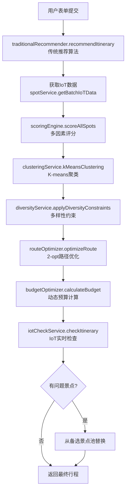

### 涉及的核心文件
- **后端**: `backend/src/services/traditionalRecommender.ts`
- **后端**: `backend/src/services/scoringEngine.ts`
- **后端**: `backend/src/services/clusteringService.ts`
- **后端**: `backend/src/services/diversityService.ts`
- **后端**: `backend/src/services/routeOptimizer.ts`
- **后端**: `backend/src/services/budgetOptimizer.ts`
- **后端**: `backend/src/services/iotCheckService.ts`
- **前端**: `frontend/src/pages/PlanGlass.tsx`

---

## 模块二：AI智能行程生成

### 功能描述
AI智能行程生成模块通过自然语言处理技术将用户的旅行需求转化为结构化的行程安排。用户可以用自然语言描述旅行计划，系统自动识别目的地、时间、预算、人数、偏好等关键信息，并调用智谱AI GLM-4大语言模型生成最优行程。

**重要说明**: AI推荐算法与传统推荐算法是**完全独立**的两种方案，AI推荐不使用多因素评分引擎、K-means聚类等传统算法，完全依赖GLM-4大语言模型的自然语言理解能力。

### 技术实现
- **AI模型**: 智谱AI GLM-4大语言模型
- **Function Calling**: 使用智谱AI的Function Calling功能实现工具调用
- **自然语言处理**: 自研参数提取算法，支持多种日期格式（相对日期、绝对日期）
- **用户画像**: 基于历史行程数据构建用户画像
- **数据库**: Prisma ORM + SQLite

### 核心算法/逻辑

#### 1. 自然语言参数提取
算法位置: `agentService.ts:520-645`

从用户输入中智能提取关键参数:
- **目的地**: 匹配城市名称（北京、上海、武汉等16个热门城市）
- **日期**: 支持相对日期（明天、后天、下周三）和绝对日期（5月1日、2024-05-01）
- **天数**: 识别"三天"、"两天"等表述，默认3天
- **预算**: 提取"预算一万"、"5000元"等，默认5000元
- **人数**: 识别"两个人"、"全家"、"独自"等，默认2人
- **偏好**: 匹配"历史文化"、"自然风光"、"美食之旅"等关键词

#### 2. GLM-4 Function Calling
算法位置: `agentService.ts:76-114`

调用智谱AI API实现工具调用:
```typescript
const data = {
  model: 'glm-4',
  messages: messages,
  temperature: 0.7,
  max_tokens: 2000,
  tools: this.getTools(),
  tool_choice: 'auto'
}
```

支持的工具:
- `create_trip`: 创建普通行程
- `extract_must_visit_spots`: 提取必选景点
- `create_trip_with_constraints`: 创建约束感知行程（含必选景点）
- `list_user_trips`: 列出用户行程
- `generate_blog`: 生成旅行博客
- `publish_blog`: 发布博客

#### 3. AI行程推荐
算法位置: `aiTripRecommender.ts:39-105`

使用GLM-4大语言模型生成行程:
```typescript
// 1. 获取景点数据（包含 IoT 数据）
const spots = await this.spotDataSvc.getCitySpotsWithIoTData(
  params.destination,
  100 // 获取更多景点供 AI 选择
);

// 2. 获取用户画像
const userProfile = await this.userProfileSvc.getUserProfile(params.userId);

// 3. 构建 AI 提示词
const prompt = this.buildRecommendationPrompt(params, spots, userProfile);

// 4. 调用智谱 AI
const response = await this.callZhipuAI(prompt);

// 5. 解析 AI 返回的结果
const result = this.parseAiResponse(response);
```

AI提示词包含:
- 用户需求（目的地、天数、预算、偏好、必选景点）
- 用户历史数据（过往行程的偏好模式）
- 可用景点列表（包含IoT数据：拥挤度、天气、开放状态）
- 要求（优先必选景点、考虑IoT数据、每天2-4个景点、地理位置合理）

#### 4. 用户画像分析
算法位置: `userProfileService.ts`

基于用户历史行程数据构建画像:
- **偏好类别**: 统计用户最常游览的景点类型
- **预算习惯**: 分析用户的历史预算范围
- **旅行节奏**: 判断用户偏好慢节奏还是快节奏
- **群体特征**: 识别用户常与谁一起旅行

### 数据流说明

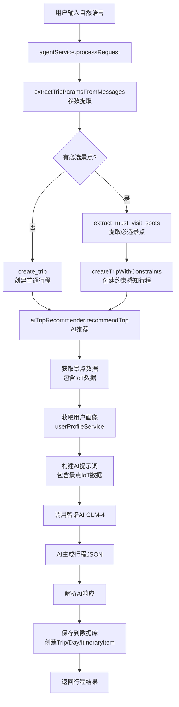

### 涉及的核心文件
- **后端**: `backend/src/services/agentService.ts`
- **后端**: `backend/src/services/aiTripRecommender.ts`
- **后端**: `backend/src/services/userProfileService.ts`
- **后端**: `backend/src/services/spotDataService.ts`
- **后端**: `backend/src/services/mustVisitSpotExtractor.ts`
- **后端**: `backend/src/services/constraintAwarePlanner.ts`
- **前端**: `frontend/src/pages/PlanGlass.tsx`
- **前端**: `frontend/src/pages/ItineraryOptimized.tsx`

---

## 模块三：IoT实时数据接入

### 功能描述
IoT实时数据接入模块通过集成物联网传感器数据，实时监控景点的拥挤度、天气状况等动态信息，为景点推荐评分提供实时参考，并根据实时数据调整行程安排。

### 技术实现
- **数据来源**: 模拟IoT传感器数据（可扩展为真实IoT设备）
- **数据存储**: SpotIoTData表存储每个景点的实时数据
- **实时更新**: 通过定时任务或API调用更新IoT数据
- **数据结构**: 拥挤度(crowdLevel)、降雨概率(rainProbability)、开放状态(isOpen)

### 核心算法/逻辑

#### 1. IoT数据结构
算法位置: `spotService.ts`

每个景点的IoT数据包含:
- **crowdLevel**: 拥挤度 (0-100)，值越大越拥挤
- **rainProbability**: 降雨概率 (0-100)，值越大降雨概率越高
- **isOpen**: 是否开放 (true/false)
- **updatedAt**: 数据更新时间

#### 2. IoT评分计算
算法位置: `scoringEngine.ts:228-265`

根据IoT数据计算实时评分:
```typescript
// 拥挤度惩罚
if (crowdLevel > 85) score -= 40;
else if (crowdLevel > 70) score -= 20;
else if (crowdLevel > 60) score -= 10;

// 天气惩罚（仅户外景点）
if (rainProbability > 70) score -= 30;
else if (rainProbability > 50) score -= 15;
else if (rainProbability > 30) score -= 5;

// 开放状态
if (isOpen === false) score = 0;
else score += 10;
```

#### 3. 实时检查与替换
算法位置: `iotCheckService.ts:9-173`

实时检查行程中的景点:
- **排除阈值**: 拥挤度>90%、降雨概率>80（家庭用户阈值更低）
- **保护机制**: 如果所有景点都被排除，保留原行程
- **备选替换**: 使用备选景点池替换被排除的景点
- **天气调整**: 根据上午降雨概率调整景点顺序（室内优先）

### 数据流说明

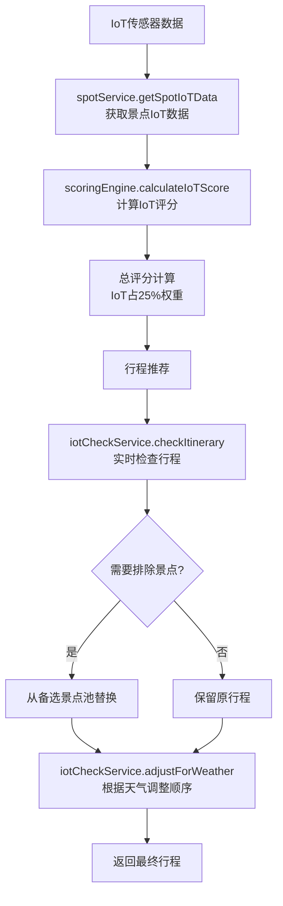

### 涉及的核心文件
- **后端**: `backend/src/services/iotCheckService.ts`
- **后端**: `backend/src/services/spotService.ts`
- **后端**: `backend/src/services/scoringEngine.ts`
- **前端**: `frontend/src/components/IoTDataCard.tsx`
- **前端**: `frontend/src/pages/Today.tsx`

---

## 模块四：多因素景点推荐引擎

### 功能描述
多因素景点推荐引擎是传统行程推荐算法的核心组件，综合考虑用户偏好、景点质量、实时数据、人群特征等多个维度，为每个景点计算综合评分，实现个性化推荐。

**重要说明**: 本模块仅用于传统推荐算法（表单创建行程），AI推荐算法不使用本模块。

### 技术实现
- **评分维度**: 偏好匹配、质量评分、IoT实时、人群适配
- **权重分配**: 35%、25%、25%、15%
- **相似度算法**: Jaccard相似度
- **类别映射**: 32个景点类别映射到13个CategoryTag
- **人群适配**: 5种群体类型的差异化推荐规则

### 核心算法/逻辑

#### 1. 景点类别映射
算法位置: `scoringEngine.ts:8-32`

将景点类别映射到CategoryTag:
```typescript
const CATEGORY_MAPPING = {
  '博物馆': ['history', 'art'],
  '古迹': ['history'],
  '公园': ['nature', 'city'],
  '主题乐园': ['theme_park'],
  '餐厅': ['food'],
  // ... 共32个类别映射
}
```

#### 2. 偏好匹配评分 (35%)
算法位置: `scoringEngine.ts:169-185`

使用Jaccard相似度计算景点类别与用户偏好的匹配度:
```typescript
const intersection = spotCategories.filter(cat => userCategories.includes(cat));
const union = Array.from(new Set([...spotCategories, ...userCategories]));
const jaccard = intersection.length / union.length;
return jaccard * 100;
```

#### 3. 质量评分 (25%)
算法位置: `scoringEngine.ts:190-209`

基于高德评分和收藏数量:
- **高德评分**: (rating / 5) * 80
- **收藏数量**: 归一化后 * 20（假设最高收藏数为100）

#### 4. IoT实时评分 (25%)
算法位置: `scoringEngine.ts:228-265`

根据拥挤度、降雨概率、开放状态实时调整（详见模块二）

#### 5. 人群适配评分 (15%)
算法位置: `scoringEngine.ts:270-303`

根据群体类型差异化推荐:
```typescript
const CROWD_ADAPTER_RULES = {
  solo: { add: ['nature', 'beach', 'art', 'city'], subtract: ['theme_park'] },
  couple: { add: ['nature', 'beach', 'art', 'city', 'food'], subtract: ['theme_park'] },
  family_with_children: { add: ['theme_park', 'nature', 'beach'], subtract: ['religious', 'history', 'adventure'] },
  // ... 共5种群体类型
}
```

#### 6. 多样性约束
算法位置: `diversityService.ts:8-45`

防止行程同质化:
- **规则1**: 每天相同CategoryTag的景点不超过2个
- **规则2**: 整个行程中同一CategoryTag占比不超过50%
- **规则3**: 每天必须包含至少2种不同CategoryTag

### 数据流说明

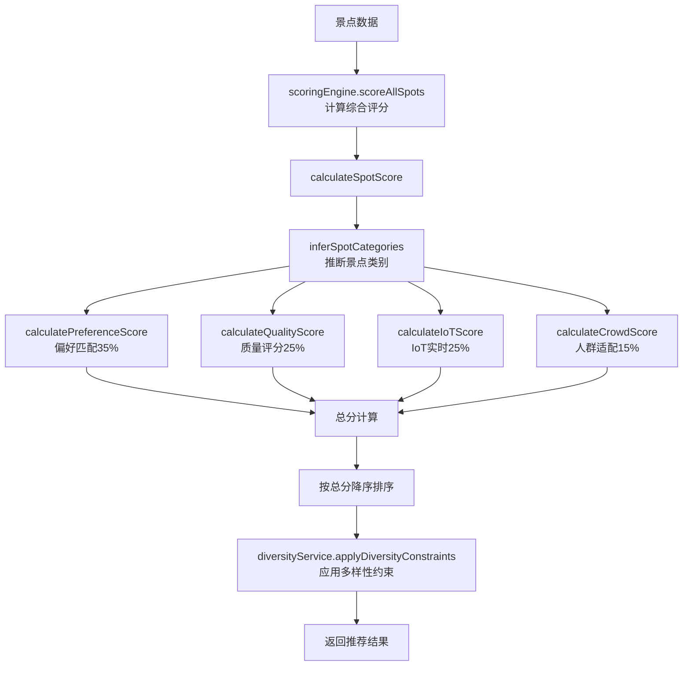

### 涉及的核心文件
- **后端**: `backend/src/services/scoringEngine.ts`
- **后端**: `backend/src/services/diversityService.ts`
- **后端**: `backend/src/services/mustVisitSpotExtractor.ts`
- **后端**: `backend/src/services/constraintAwarePlanner.ts`

---

## 模块五：行程规划与编辑

### 功能描述
行程规划与编辑模块提供行程的创建、展示、编辑、删除等功能，支持拖拽排序、备选景点替换、预算动态计算等高级功能。

### 技术实现
- **数据模型**: Trip → Day → ItineraryItem 三层结构
- **拖拽排序**: React DnD库实现
- **备选替换**: SpotAlternative表存储备选景点
- **预算计算**: 动态计算景点费用、交通费用、住宿费用
- **状态管理**: Zustand状态管理

### 核心算法/逻辑

#### 1. 行程数据结构
算法位置: `prisma/schema.prisma`

```
Trip (行程)
  ├── Day (天)
  │     ├── ItineraryItem (行程项目)
  │     │     ├── type: 'spot' | 'hotel' | 'restaurant'
  │     │     ├── startTime/endTime
  │     │     ├── cost
  │     │     └── spotId
  │     └── notes
  ├── budget (预算)
  └── aiGenerated: boolean
```

#### 2. 拖拽排序
算法位置: `frontend/src/pages/ItineraryOptimized.tsx`

使用React DnD实现:
```typescript
<DndProvider backend={HTML5Backend}>
  {itineraryItems.map((item, index) => (
    <DraggableItem
      key={item.id}
      index={index}
      item={item}
      moveItem={handleMoveItem}
    />
  ))}
</DndProvider>
```

#### 3. 备选景点替换
算法位置: `iotCheckService.ts:188-247`

当景点被IoT检查排除时，从备选景点池选择评分最高的备选景点替换:
```typescript
const alternatives = alternativePools[attraction.spotId];
if (alternatives && alternatives.length > 0) {
  const bestAlternative = alternatives[0]; // 选择评分最高的
  // 创建替换后的行程项目
}
```

#### 4. 动态预算计算
算法位置: `budgetOptimizer.ts`

根据城市等级、季节性、群体类型动态计算:
- **城市等级**: 一线城市（北京、上海）价格×1.2，二线城市×1.0
- **季节性**: 旺季（7-8月、国庆、春节）价格×1.3，淡季×0.8
- **群体类型**: 家庭（4人）价格×1.5，情侣（2人）×1.0

### 数据流说明

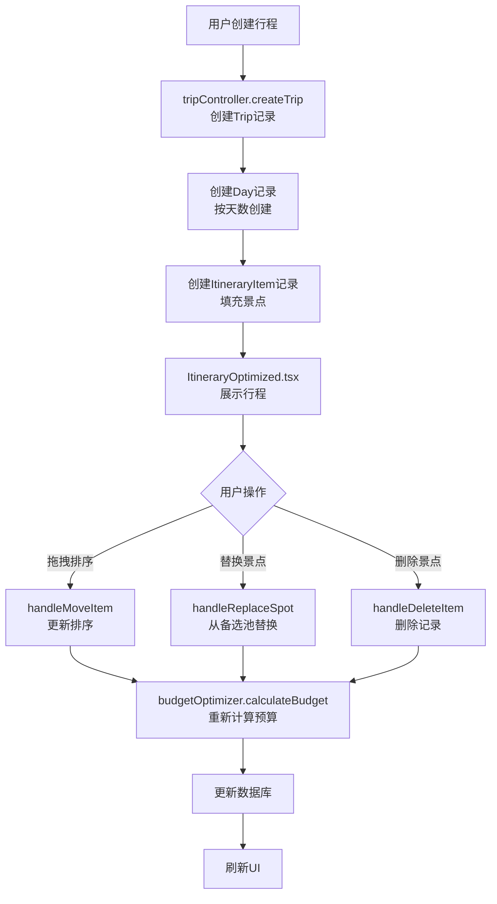

### 涉及的核心文件
- **前端**: `frontend/src/pages/ItineraryOptimized.tsx`
- **前端**: `frontend/src/pages/TripDetail.tsx`
- **后端**: `backend/src/controllers/tripController.ts`
- **后端**: `backend/src/services/budgetOptimizer.ts`

---

## 模块六：地图服务与路线展示

### 功能描述
地图服务与路线展示模块集成高德地图API，在地图上标记景点、酒店、餐厅等位置，并绘制游览路线，实现可视化的行程规划。

### 技术实现
- **地图API**: 高德地图JavaScript API
- **路线绘制**: AMap.Polyline绘制路线
- **标记点**: AMap.Marker标记景点/酒店/餐厅
- **路线优化**: 2-opt算法优化路线顺序
- **距离计算**: Haversine公式计算距离

### 核心算法/逻辑

#### 1. 高德地图API集成
算法位置: `frontend/src/lib/amap.ts`

初始化地图:
```typescript
const map = new AMap.Map('container', {
  zoom: 12,
  center: [lng, lat],
  mapStyle: 'amap://styles/whitesmoke'
})
```

#### 2. 景点标记
算法位置: `frontend/src/components/ItineraryMap.tsx`

为每个景点创建标记:
```typescript
const marker = new AMap.Marker({
  position: [lng, lat],
  title: spot.name,
  content: createMarkerContent(spot)
})
map.add(marker)
```

#### 3. 路线绘制
算法位置: `frontend/src/components/ItineraryMap.tsx`

使用Polyline绘制路线:
```typescript
const path = spots.map(spot => {
  const [lng, lat] = spot.location.split(',')
  return [lng, lat]
})
const polyline = new AMap.Polyline({
  path: path,
  strokeColor: '#f59e0b',
  strokeWeight: 4
})
map.add(polyline)
```

#### 4. 距离计算
算法位置: `amapService.ts:304-326`

使用Haversine公式计算两点间距离:
```typescript
const R = 6371 // 地球半径（公里）
const dLat = toRadians(lat2 - lat1)
const dLng = toRadians(lng2 - lng1)
const a = Math.sin(dLat / 2) * Math.sin(dLat / 2) +
        Math.cos(toRadians(lat1)) * Math.cos(toRadians(lat2)) *
        Math.sin(dLng / 2) * Math.sin(dLng / 2)
const c = 2 * Math.atan2(Math.sqrt(a), Math.sqrt(1 - a))
const distance = R * c
```

### 数据流说明

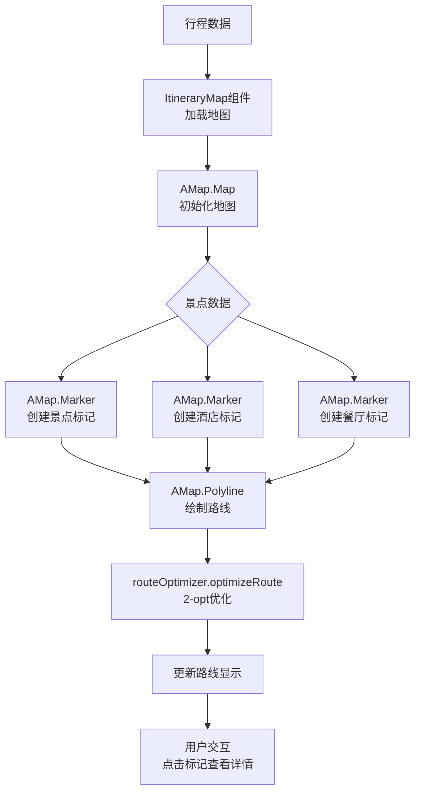

### 涉及的核心文件
- **后端**: `backend/src/services/amapService.ts`
- **前端**: `frontend/src/pages/ItineraryOptimized.tsx`
- **前端**: `frontend/src/components/ItineraryMap.tsx`
- **前端**: `frontend/src/pages/collab/CollabRoom.tsx`

---

## 模块七：多人协同规划

### 功能描述
多人协同规划模块支持多个用户共同规划行程，通过WebSocket实现实时通信，支持光标同步、草案编辑、消息聊天等功能。

### 技术实现
- **WebSocket**: Socket.io实现实时通信
- **房间管理**: CollabRoom表管理协同房间
- **成员管理**: TripMember表管理房间成员
- **草案管理**: DraftRoute表管理用户草案
- **消息管理**: CollabMessage表管理聊天消息
- **权限控制**: Host和Collaborator两种角色

### 核心算法/逻辑

#### 1. 房间创建与加入
算法位置: `collabService.ts:18-138`

创建房间:
```typescript
const inviteToken = uuidv4();
const inviteExpiresAt = addHours(new Date(), 72);
const room = await prisma.collabRoom.create({
  data: {
    tripId,
    hostId,
    inviteToken,
    inviteExpiresAt,
    phase: 'EDITING'
  }
})
```

加入房间:
```typescript
const room = await prisma.collabRoom.findUnique({
  where: { inviteToken: token }
});
if (new Date() > room.inviteExpiresAt) {
  throw new Error('邀请链接已过期');
}
```

#### 2. WebSocket通信机制
算法位置: `socketService.ts:22-224`

Socket.io事件:
- **join_room**: 加入房间
- **leave_room**: 离开房间
- **cursor:move**: 光标移动
- **draft:update**: 草案更新
- **draft:submitted**: 草案提交
- **room:lock**: 房间锁定
- **message:new**: 新消息

#### 3. 光标同步
算法位置: `socketService.ts:126-136`

实时同步光标位置:
```typescript
socket.on('cursor:move', (data: { roomId, userId, lat, lng }) => {
  socket.to(roomId).emit('cursor:update', {
    userId,
    lat,
    lng,
    timestamp: new Date()
  });
});
```

#### 4. 草案提交与合并
算法位置: `collabService.ts:257-337`

Upsert草案:
```typescript
const draft = await prisma.draftRoute.upsert({
  where: {
    roomId_userId_dayNumber: { roomId, userId, dayNumber }
  },
  update: {
    spotSequence: JSON.stringify(spotSequence),
    polylineData: JSON.stringify(polylineData),
    version: { increment: 1 }
  },
  create: {
    roomId, userId, dayNumber,
    spotSequence: JSON.stringify(spotSequence),
    polylineData: JSON.stringify(polylineData),
    isSubmitted: false,
    version: 1
  }
});
```

#### 5. 房间锁定与最终路线确定
算法位置: `collabService.ts:237-246`

Host锁定房间后，所有成员无法再编辑:
```typescript
const room = await prisma.collabRoom.update({
  where: { id: roomId },
  data: { phase: 'LOCKED' }
});
```

### 数据流说明

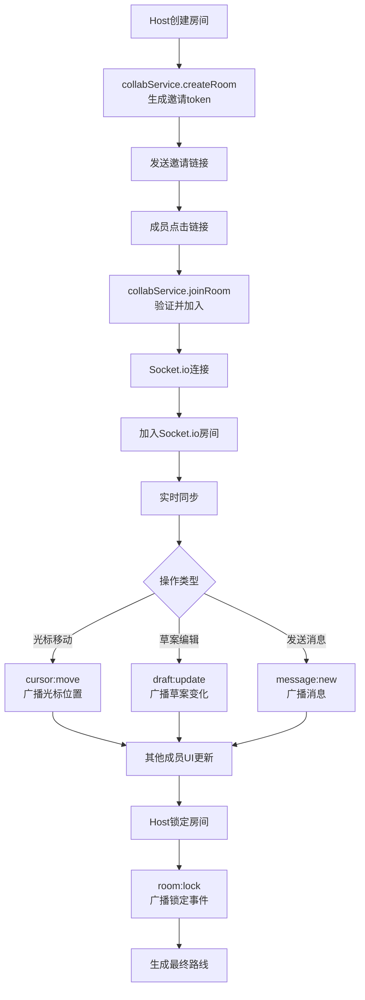

### 涉及的核心文件
- **后端**: `backend/src/services/collabService.ts`
- **后端**: `backend/src/socket/socketService.ts`
- **前端**: `frontend/src/pages/collab/CollabRoom.tsx`
- **前端**: `frontend/src/store/collabStore.ts`

---

## 模块八：AI旅行顾问对话

### 功能描述
AI旅行顾问对话模块提供智能问答服务，支持两种模式：
1. **问答助手模式**: 回答旅行相关问题（景点推荐、行程建议、预算参考等）
2. **智能助手模式**: 使用Function Calling自动创建行程、生成博客等

### 技术实现
- **AI模型**: 智谱AI GLM-4大语言模型
- **对话管理**: ChatSession表管理会话，ChatMessage表管理消息
- **上下文管理**: 保留最近10条消息作为上下文
- **数据增强**: 从数据库获取景点数据增强AI回答
- **重试机制**: API调用失败自动重试2次

### 核心算法/逻辑

#### 1. 对话会话管理
算法位置: `chatHistoryService.ts:47-126`

自动创建或复用会话（10分钟内有效）:
```typescript
const tenMinutesAgo = new Date(Date.now() - 10 * 60 * 1000);
let session = await prisma.chatSession.findFirst({
  where: {
    userId: userId || null,
    mode: 'advisor',
    createdAt: { gte: tenMinutesAgo }
  }
});
if (!session) {
  session = await this.createSession({ userId, mode: 'advisor' });
}
```

#### 2. 问答助手模式
算法位置: `advisorService.ts:216-303`

系统提示词定义AI能力范围:
```
【能力范围】
✅ 目的地介绍、景点推荐、最佳游览季节
✅ 行程建议、景点组合、游览顺序
✅ 预算参考、省钱技巧、费用分配
✅ 交通方式、住宿类型、餐饮方向

【边界约束】
❌ 不直接创建或修改任何行程数据
❌ 不访问用户的个人行程信息
❌ 不处理与旅行无关的问题
```

#### 3. 景点数据增强
算法位置: `advisorService.ts:78-211`

当用户询问景点推荐时，从数据库获取景点数据:
```typescript
if (this.needsSpotData(question) && planContext?.destination) {
  const spots = await this.getSpotsFromDatabase(
    planContext.destination,
    planContext.preferences,
    20
  );
  if (spots.length > 0) {
    const spotsInfo = this.formatSpotsForPrompt(spots);
    messages[messages.length - 1].content += spotsInfo;
  }
}
```

#### 4. 智能助手模式
算法位置: `agentService.ts:1434-1615`

使用Function Calling自动调用工具:
```typescript
const result = await this.callZhipuAI(
  messages,
  this.getTools(),
  'auto' // AI自动决定是否调用工具
);

if (assistantMessage?.tool_calls && assistantMessage.tool_calls.length > 0) {
  for (const toolCall of assistantMessage.tool_calls) {
    const toolResult = await this.executeToolCall(toolCall, userId);
    // 自动触发下一个工具调用
    if (toolName === 'extract_must_visit_spots' && toolResult.success) {
      await this.createTripWithConstraints(params, userId);
    }
  }
}
```

### 数据流说明

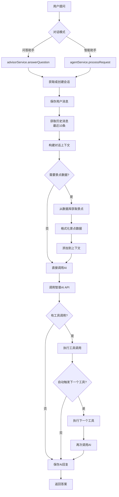

### 涉及的核心文件
- **后端**: `backend/src/services/advisorService.ts`
- **后端**: `backend/src/services/agentService.ts`
- **后端**: `backend/src/services/chatHistoryService.ts`
- **前端**: `frontend/src/pages/AIFeaturesGlass.tsx`
- **前端**: `frontend/src/components/AIAdvisorGlass.tsx`

---

## 模块九：酒店与餐厅推荐

### 功能描述
酒店与餐厅推荐模块根据用户的目的地、预算、偏好等条件，推荐合适的酒店和餐厅，支持基于位置的周边搜索。

### 技术实现
- **数据来源**: 高德地图POI API
- **推荐策略**: 基于评分、距离、价格综合排序
- **周边搜索**: 根据中心点坐标搜索周边POI
- **缓存机制**: amapPOICacheService缓存POI数据
- **数据去重**: 根据名称和位置去重

### 核心算法/逻辑

#### 1. 酒店推荐
算法位置: `hotelRecommender.ts`

推荐策略:
```typescript
// 1. 从高德API获取酒店数据
const hotels = await amapService.searchAround(
  centerLocation,
  '酒店',
  undefined,
  3000 // 3公里半径
);

// 2. 综合评分 = 评分权重×0.5 + 距离权重×0.3 + 价格权重×0.2
hotels.forEach(hotel => {
  const score = hotel.rating * 0.5 +
                (1 - hotel.distance / 3000) * 0.3 +
                (1 - hotel.price / maxPrice) * 0.2;
  hotel.totalScore = score;
});

// 3. 按评分降序排序
hotels.sort((a, b) => b.totalScore - a.totalScore);
```

#### 2. 餐厅推荐
算法位置: `restaurantRecommender.ts`

推荐策略:
```typescript
// 1. 从高德API获取餐厅数据
const restaurants = await amapService.getRestaurants(city);

// 2. 根据用户偏好过滤
if (preferences.includes('美食')) {
  restaurants = restaurants.filter(r => r.rating >= 4.5);
}

// 3. 综合评分 = 评分权重×0.6 + 价格权重×0.4
restaurants.forEach(restaurant => {
  const score = restaurant.rating * 0.6 +
                (1 - restaurant.cost / maxCost) * 0.4;
  restaurant.totalScore = score;
});
```

#### 3. 周边搜索
算法位置: `amapService.ts:218-271`

根据中心点坐标搜索周边POI:
```typescript
const response = await this.client.get('/place/around', {
  params: {
    location: centerLocation,
    keywords: keywords,
    radius: radius,
    extensions: 'all' // 获取详细信息
  }
});
```

#### 4. 缓存机制
算法位置: `amapPOICacheService.ts`

缓存POI数据减少API调用:
```typescript
// 尝试从缓存获取
const cached = await prisma.amapPOICache.findUnique({
  where: { city }
});

if (cached && Date.now() - cached.updatedAt.getTime() < 24 * 60 * 60 * 1000) {
  return JSON.parse(cached.data);
}

// 缓存失效，调用API
const data = await this.callAmapAPI(city);
await prisma.amapPOICache.upsert({
  where: { city },
  update: { data: JSON.stringify(data), updatedAt: new Date() },
  create: { city, data: JSON.stringify(data) }
});
```

### 数据流说明

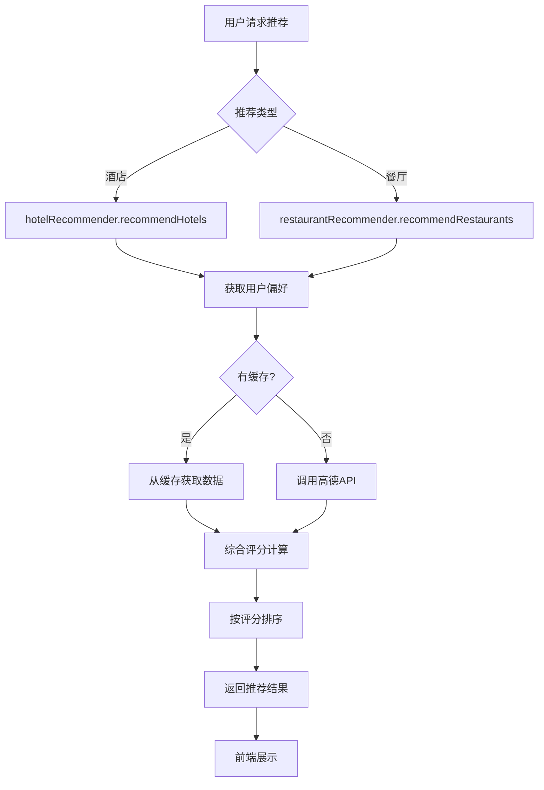

### 涉及的核心文件
- **后端**: `backend/src/services/hotelRecommender.ts`
- **后端**: `backend/src/services/restaurantRecommender.ts`
- **后端**: `backend/src/services/amapService.ts`
- **后端**: `backend/src/services/amapPOICacheService.ts`
- **前端**: `frontend/src/components/HotelRecommendations.tsx`
- **前端**: `frontend/src/components/RestaurantRecommendations.tsx`

---

## 模块十：行程分享与PDF导出

### 功能描述
行程分享与PDF导出模块支持用户将行程分享给他人，以及将行程导出为PDF文件，方便离线查看和打印。

### 技术实现
- **分享机制**: 生成分享token，验证后展示只读视图
- **PDF生成**: jspdf + html2canvas将HTML转换为PDF
- **只读视图**: 复刻行程数据到SharedTrip表
- **Token管理**: ShareToken表管理分享token

### 核心算法/逻辑

#### 1. 分享Token生成
算法位置: `shareService.ts:18-45`

生成唯一token并设置过期时间:
```typescript
const token = uuidv4();
const expiresAt = addHours(new Date(), 168); // 7天过期

const shareToken = await prisma.shareToken.create({
  data: {
    tripId,
    userId,
    token,
    expiresAt
  }
});

const shareUrl = `${process.env.FRONTEND_URL}/shared/${token}`;
return { shareUrl, token };
```

#### 2. 分享验证
算法位置: `shareService.ts:47-78`

验证token有效性:
```typescript
const shareToken = await prisma.shareToken.findUnique({
  where: { token },
  include: { trip: true }
});

if (!shareToken) {
  throw new Error('分享链接无效');
}

if (new Date() > shareToken.expiresAt) {
  throw new Error('分享链接已过期');
}

return shareToken.trip;
```

#### 3. PDF生成
算法位置: `PDFExportButton.tsx`

使用jspdf和html2canvas生成PDF:
```typescript
import jsPDF from 'jspdf';
import html2canvas from 'html2canvas';

const element = document.getElementById('itinerary-content');
const canvas = await html2canvas(element);
const imgData = canvas.toDataURL('image/png');

const pdf = new jsPDF('p', 'mm', 'a4');
const imgWidth = 210; // A4宽度
const imgHeight = (canvas.height * imgWidth) / canvas.width;

pdf.addImage(imgData, 'PNG', 0, 0, imgWidth, imgHeight);
pdf.save(`${trip.title}.pdf`);
```

#### 4. 只读视图复刻
算法位置: `shareService.ts:80-120`

复刻行程数据到SharedTrip表:
```typescript
const sharedTrip = await prisma.sharedTrip.create({
  data: {
    tripId: trip.id,
    title: trip.title,
    destination: trip.destination,
    startDate: trip.startDate,
    endDate: trip.endDate,
    days: JSON.stringify(trip.days),
    budget: trip.budget
  }
});
```

### 数据流说明

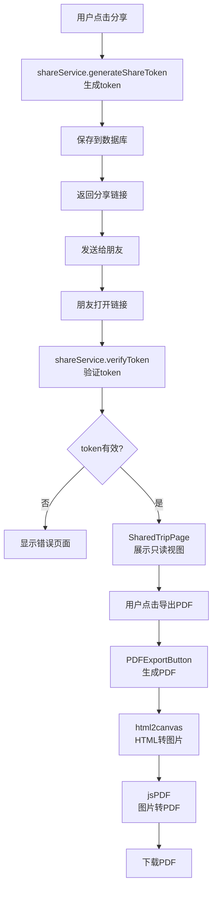

### 涉及的核心文件
- **后端**: `backend/src/services/shareService.ts`
- **前端**: `frontend/src/components/ShareButton.tsx`
- **前端**: `frontend/src/components/PDFExportButton.tsx`
- **前端**: `frontend/src/pages/SharedTrip.tsx`

---

## 模块十一：旅行博客社区

### 功能描述
旅行博客社区模块允许用户发布旅行游记、浏览他人游记、点赞评论，支持富文本编辑和图片上传。

### 技术实现
- **富文本编辑器**: TipTap编辑器
- **图片管理**: Cloudinary云存储
- **博客审核**: 管理员审核机制
- **点赞评论**: BlogLike和BlogComment表
- **标签系统**: tags字段存储标签

### 核心算法/逻辑

#### 1. TipTap富文本编辑器
算法位置: `TipTapEditor.tsx`

初始化编辑器:
```typescript
const editor = useEditor({
  extensions: [
    StarterKit,
    Image,
    Link.configure({
      openOnClick: false
    }),
    Placeholder.configure({
      placeholder: '写下你的旅行故事...'
    })
  ],
  content: initialContent,
  onUpdate: ({ editor }) => {
    setContent(editor.getHTML());
  }
});
```

#### 2. 博客发布流程
算法位置: `blogService.ts:18-65`

创建博客草稿:
```typescript
const blog = await prisma.blogPost.create({
  data: {
    userId,
    title,
    content,
    city,
    spotIds: selectedSpots.join(','),
    tags: tags.join(','),
    status: 'draft',
    isPublished: false
  }
});
```

审核通过后发布:
```typescript
await prisma.blogPost.update({
  where: { id: blogId },
  data: {
    status: 'published',
    isPublished: true,
    publishedAt: new Date()
  }
});
```

#### 3. 图片上传
算法位置: `imageService.ts:18-55`

上传到Cloudinary:
```typescript
const result = await cloudinary.uploader.upload(file.path, {
  folder: 'livetrip/blogs',
  public_id: `${userId}_${Date.now()}`,
  transformation: [
    { width: 1200, height: 800, crop: 'limit' },
    { quality: 'auto' }
  ]
});

const image = await prisma.spotImage.create({
  data: {
    url: result.secure_url,
    publicId: result.public_id,
    spotId,
    status: 'pending'
  }
});
```

#### 4. 点赞与评论
算法位置: `blogService.ts:120-180`

点赞:
```typescript
const existingLike = await prisma.blogLike.findUnique({
  where: {
    blogId_userId: { blogId, userId }
  }
});

if (existingLike) {
  await prisma.blogLike.delete({
    where: { id: existingLike.id }
  });
} else {
  await prisma.blogLike.create({
    data: { blogId, userId }
  });
}
```

评论:
```typescript
await prisma.blogComment.create({
  data: {
    blogId,
    userId,
    content
  }
});
```

### 数据流说明

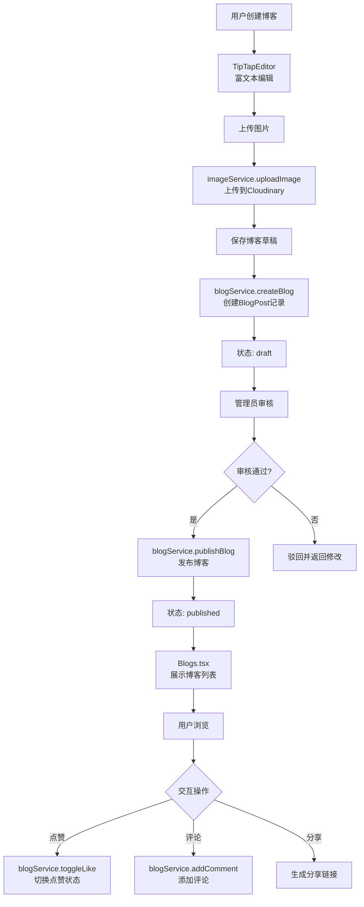

### 涉及的核心文件
- **后端**: `backend/src/services/blogService.ts`
- **后端**: `backend/src/controllers/blogController.ts`
- **后端**: `backend/src/services/imageService.ts`
- **前端**: `frontend/src/components/TipTapEditor.tsx`
- **前端**: `frontend/src/pages/BlogsGlass.tsx`
- **前端**: `frontend/src/pages/BlogDetailPage.tsx`

---

## 模块十二：景点图片管理与审核

### 功能描述
景点图片管理与审核模块支持用户上传景点图片，管理员审核后展示，确保图片质量和内容合规。

### 技术实现
- **云存储**: Cloudinary云存储
- **图片处理**: 自动压缩、裁剪、水印
- **审核流程**: pending → approved/rejected状态机
- **权限控制**: 仅管理员可审核
- **优先级管理**: isPrimary标记主图，priority排序

### 核心算法/逻辑

#### 1. 图片上传流程
算法位置: `imageService.ts:18-55`

上传并处理图片:
```typescript
const result = await cloudinary.uploader.upload(file.path, {
  folder: 'livetrip/spots',
  public_id: `${spotId}_${Date.now()}`,
  transformation: [
    { width: 1200, height: 800, crop: 'limit' }, // 限制最大尺寸
    { quality: 'auto' }, // 自动优化质量
    { overlay: { text: 'LiveTrip', ... } } // 添加水印
  ]
});

const image = await prisma.spotImage.create({
  data: {
    url: result.secure_url,
    publicId: result.public_id,
    spotId,
    status: 'pending', // 待审核
    isPrimary: false,
    priority: 0
  }
});
```

#### 2. 审核状态机
算法位置: `adminController.ts:120-180`

审核流程:
```
pending (待审核)
    ↓
approved (已通过) ← rejected (已拒绝)
```

审核通过:
```typescript
await prisma.spotImage.update({
  where: { id: imageId },
  data: {
    status: 'approved',
    reviewedBy: adminId,
    reviewedAt: new Date()
  }
});
```

审核拒绝:
```typescript
await prisma.spotImage.update({
  where: { id: imageId },
  data: {
    status: 'rejected',
    rejectionReason: reason,
    reviewedBy: adminId,
    reviewedAt: new Date()
  }
});
```

#### 3. 主图管理
算法位置: `imageService.ts:80-120`

设置主图:
```typescript
// 取消该景点其他图片的主图标记
await prisma.spotImage.updateMany({
  where: {
    spotId,
    isPrimary: true
  },
  data: { isPrimary: false }
});

// 设置当前图片为主图
await prisma.spotImage.update({
  where: { id: imageId },
  data: {
    isPrimary: true,
    priority: 100 // 主图优先级最高
  }
});
```

#### 4. 图片排序
算法位置: `imageService.ts:150-180`

更新图片优先级:
```typescript
await prisma.$transaction(
  imageIds.map((id, index) =>
    prisma.spotImage.update({
      where: { id },
      data: { priority: (imageIds.length - index) * 10 }
    })
  )
);
```

### 数据流说明

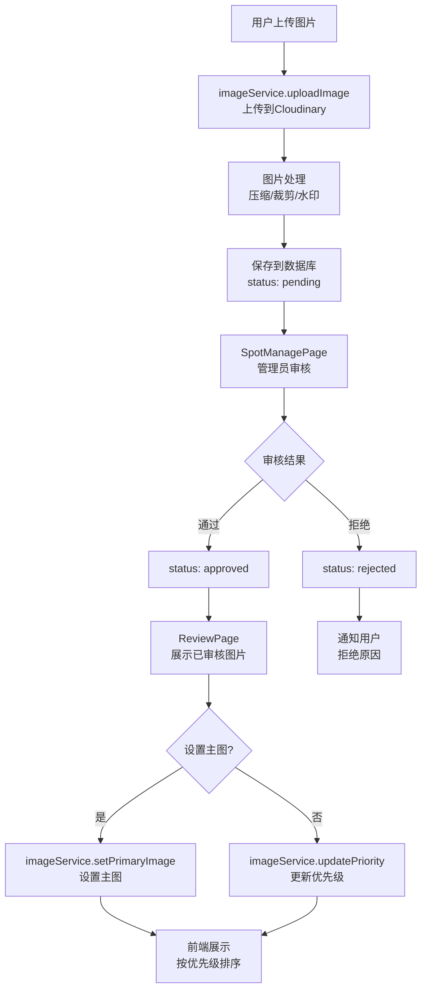

### 涉及的核心文件
- **后端**: `backend/src/services/imageService.ts`
- **后端**: `backend/src/controllers/adminController.ts`
- **前端**: `frontend/src/pages/admin/SpotManagePage.tsx`
- **前端**: `frontend/src/pages/admin/ReviewPage.tsx`

---

## 模块十三：用户认证与权限控制

### 功能描述
用户认证与权限控制模块负责用户注册、登录、权限验证，确保系统安全性。

### 技术实现
- **认证方式**: JWT Token
- **密码加密**: bcrypt哈希
- **中间件**: Express中间件验证Token
- **路由守卫**: 前端路由守卫 + 后端中间件
- **角色管理**: user、admin两种角色

### 核心算法/逻辑

#### 1. 用户注册
算法位置: `authController.ts:18-55`

注册流程:
```typescript
// 检查用户名是否已存在
const existingUser = await prisma.user.findUnique({
  where: { username }
});

if (existingUser) {
  throw new Error('用户名已存在');
}

// 密码加密
const passwordHash = await bcrypt.hash(password, 10);

// 创建用户
const user = await prisma.user.create({
  data: {
    username,
    email,
    passwordHash,
    role: 'user'
  }
});
```

#### 2. 用户登录
算法位置: `authController.ts:57-95`

登录流程:
```typescript
// 验证用户名和密码
const user = await prisma.user.findUnique({
  where: { username }
});

if (!user) {
  throw new Error('用户名或密码错误');
}

const isValidPassword = await bcrypt.compare(password, user.passwordHash);

if (!isValidPassword) {
  throw new Error('用户名或密码错误');
}

// 生成JWT Token
const token = jwt.sign(
  { userId: user.id, username: user.username, role: user.role },
  process.env.JWT_SECRET,
  { expiresIn: '7d' }
);

return { token, user };
```

#### 3. Token验证中间件
算法位置: `middleware/authMiddleware.ts:18-45`

验证Token:
```typescript
export const authMiddleware = async (req: any, res: any, next: any) => {
  try {
    const token = req.headers.authorization?.replace('Bearer ', '');

    if (!token) {
      return res.status(401).json({ error: '未提供认证Token' });
    }

    const decoded = jwt.verify(token, process.env.JWT_SECRET) as any;
    req.user = decoded;
    next();
  } catch (error) {
    return res.status(401).json({ error: 'Token无效或已过期' });
  }
};
```

#### 4. 管理员权限中间件
算法位置: `middleware/adminAuthMiddleware.ts:18-35`

验证管理员权限:
```typescript
export const adminAuthMiddleware = async (req: any, res: any, next: any) => {
  if (req.user.role !== 'admin') {
    return res.status(403).json({ error: '需要管理员权限' });
  }
  next();
};
```

#### 5. 前端路由守卫
算法位置: `AuthGuard.tsx`

路由守卫组件:
```typescript
export const AuthGuard = ({ children }: { children: React.ReactNode }) => {
  const { user } = useAuthStore();

  if (!user) {
    return <Navigate to="/auth" replace />;
  }

  return <>{children}</>;
};

export const AdminGuard = ({ children }: { children: React.ReactNode }) => {
  const { user } = useAuthStore();

  if (!user || user.role !== 'admin') {
    return <Navigate to="/" replace />;
  }

  return <>{children}</>;
};
```

### 数据流说明

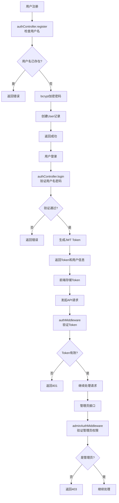

### 涉及的核心文件
- **后端**: `backend/src/controllers/authController.ts`
- **后端**: `backend/src/middleware/authMiddleware.ts`
- **后端**: `backend/src/middleware/adminAuthMiddleware.ts`
- **前端**: `frontend/src/components/AuthGuard.tsx`
- **前端**: `frontend/src/components/AdminGuard.tsx`
- **前端**: `frontend/src/pages/Auth.tsx`

---

## 总结

LiveTrip是一个功能完善的智能旅行规划平台，采用现代化的技术栈和优雅的设计风格，具有以下技术亮点:

1. **自主算法**: 多因素评分引擎 + K-means聚类 + 2-opt路径优化
2. **AI集成**: 智谱AI GLM-4实现Function Calling和智能问答
3. **实时通信**: Socket.io实现多人协同规划
4. **现代化UI**: Glass-morphism设计 + Tailwind CSS
5. **类型安全**: 全栈TypeScript
6. **数据库管理**: Prisma ORM + SQLite
7. **云存储**: Cloudinary图片存储
8. **外部集成**: 高德地图、OpenWeather

整个系统架构清晰、模块化程度高，具有良好的扩展性和维护性。
